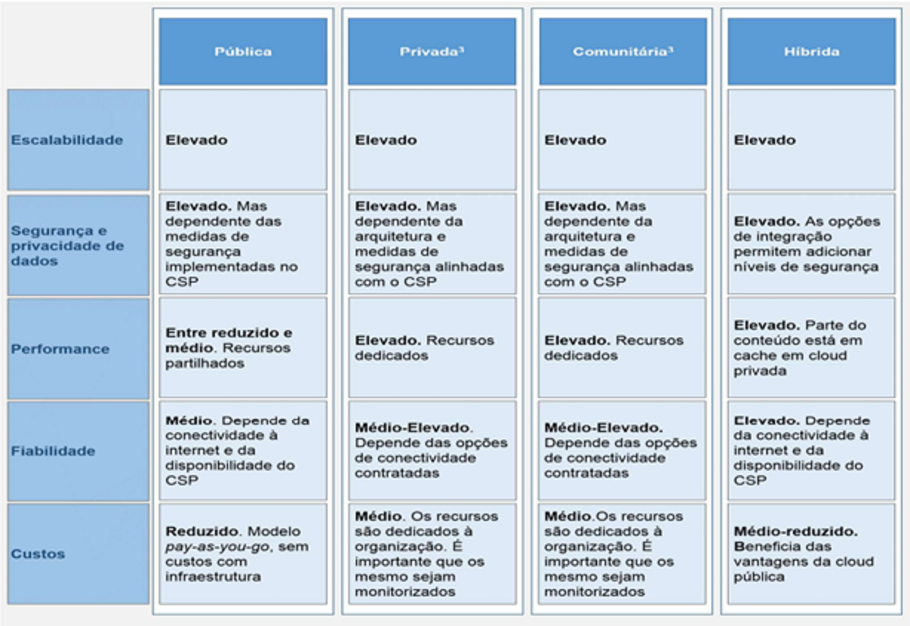

# Comparativo dos modelos de implementação

  
  <h5>Fonte: Estratégia Cloud para a Administração Pública em Portugal Novembro 2020</h5>

 

Para efeitos de comparação, considerou-se _cloud_ privada e comunitária como fornecida e alojada num fornecedor público (CSP).

***

