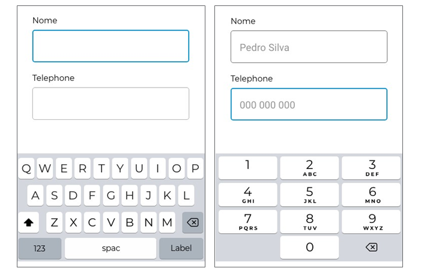
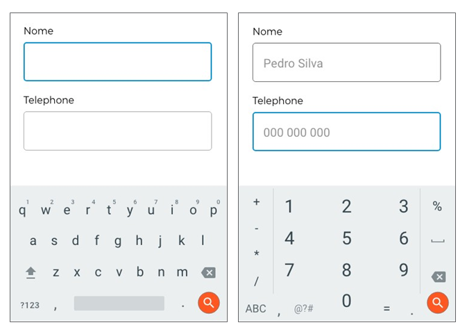

# Componentes da Interface

## Ap**resentação de conteúdo**

Um dos casos mais comuns de consumo de conteúdos em dispositivos móveis é a utilização dos mesmos como forma de entretenimento ou para ocupar um tempo de espera (por exemplo, enquanto espera uma consulta ou por um meio de transporte). Nestes cenários, os utilizadores valorizam bastante a rapidez do acesso à informação, ficando impacientes com aplicações que desperdiçam o seu tempo.

Assim, no que diz respeito à apresentação de conteúdo, é recomendado manter o conteúdo para dispositivos móveis curto e sucinto, atendendo ao seu contexto de utilização.

Em termos de boas práticas, para evitar desconforto nas situações acima descritas, devemos considerar as seguintes:

Reduzir o conteúdo, para apresentar apenas o que é estritamente necessário. Muitas vezes os utilizadores preferem um resumo do conteúdo que aborda apenas os temas principais, especialmente no caso de notícias;

Caso exista informação secundária que possa ser pertinente, esta deverá ser colocada num segundo ecrã mais fácil de consultar (para quem estiver mesmo interessado).

&#x20;

## **Tipografia**

A distância a que o utilizador segura o dispositivo móvel, enquanto o utiliza, é variável e depende do contexto de utilização e do tamanho do dispositivo.

  
  <h5>Distâncias do ecrã dependente no dispositivo</h5>

 

Além disso, quando se trata de dispositivos móveis maiores como _tablets_, os utilizadores habitualmente usam-nos com algum tipo de suporte:

  
  <h5>Forma de uso dependente do tamanho do dispositivo</h5>

 

Os dispositivos mais pequenos são mais utilizados quando o utilizador está em movimento, tanto na rua, como em casa. Os dispositivos maiores normalmente são utilizados à distância de um portátil.

Abaixo encontra-se uma tabela que apresenta as melhores práticas para usar tipografia em dispositivos móveis baseado no contexto, tamanho e distância de utilização:

**Tamanho dos conteúdos e subtítulos, em pontos tipográficos**

| 
 

Classe do Dispositivo
 | Tamanho Mínimo    | Conteúdo Básico   | Conteúdo Melhorado | 
 

H3
 | 
 

H2
 | 
 

H1
 |
| ------------------------------------ | ----------------- | ----------------- | ------------------ | ----------------- | ----------------- | ----------------- |
| Telemóvel Pequeno                    | 4                 | 5.5               | 7.2                | 8.5               | 10.8              | 14.4              |
| Telemóvel Grande                     | 6                 | 8.5               | 10.8               | 12.6              | 16.2              | 21.6              |
| Phablet                              | 7                 | 9.8               | 12.6               | 14.7              | 18.9              | 25.2              |
| Tablet Pequeno                       | 8                 | 11.2              | 14.4               | 18.8              | 21.6              | 28.8              |
| Tablet Grande/ Desktop               | 
 

10
 | 
 

14
 | 
 

18
  | 
 

21
 | 
 

27
 | 
 

36
 |

_Tabela 1 - guia para tipografia_

## Navegação

&#x20;

As boas práticas de usabilidade indicam que a navegação deverá ser evidente, uma vez que disponibilizar a melhor funcionalidade ou conteúdo não tem qualquer utilidade se o utilizador não conseguir encontrar essa funcionalidade ou conteúdo.

Algumas regras básicas para a componente de navegação numa aplicação móvel são:

* Não esconder elementos de navegação – devem ser evitados elementos de navegação oculta, como por exemplo a navegação por gestos, porque os utilizadores irão ter dificuldade em identificar essa forma de navegação;
* Navegação consistente - muitas vezes, quem desenvolve aplicações esconde a navegação em páginas individuais. Esta prática deve ser evitada porque pode confundir ou desorientar o utilizador;
* Comunicar a localização atual - uma das maiores falhas no desenvolvimento de aplicações móveis é a falta de indicadores da localização onde o utilizador se encontra na aplicação. Para um utilizador entender para onde quer navegar, este precisa de perceber onde está.

Em geral, é boa pratica apresentar ao utilizador apenas um caminho para cada ecrã. Se o utilizador precisa de ver um ecrã em vários contextos, considere o uso de um alerta, _pop over_ ou exibição modal.

**Dica:** A melhor solução é utilizar padrões de navegação estabelecidos – como o _Tab Bar_ (para iOS) e _Navigation Drawer_ (para Android). A grande maioria dos utilizadores de aplicações móveis estão familiarizados com os dois padrões de navegação. Quando há uma solução simples, não é preciso repensar tudo.

### Deslizar na horizontal

O deslizar vertical como forma de interação já é considerado normal para utilizadores de dispositivos eletrónicos. Com a introdução de dipositivos móveis, com espaço de ecrã limitado, o deslizar na horizontal, que antes era considerado confuso, neste momento é aceite como solução bastante útil.

&#x20;

#### **Quando usar deslizar na horizontal**

O deslizar na horizontal funciona bem quando se pretende mostrar um subconjunto de uma categoria. Alguns exemplos:

1\.        Um catálogo de produtos ou itens, com muitos elementos:

  
  <h5>Exemplo de apresentação de vários itens horizontalmente</h5>

 

2\.        Apresentar informação numa área visual muito grande que não é fácil de ver de relance como por exemplo num mapa.

  
  <h5>Exemplo de deslizar horizontal usado num mapa</h5>

 

3\.     Mostrar secções discretas ou partes de informação em aplicações

  
  <h5>Exemplo de mostrar informações extra de uma secção</h5>

 

#### Como usar o deslizar na horizontal

&#x20;Embora muito útil, o deslizar na horizontal pode ser pouco intuitivo se não for apresentado da forma correta. É necessário indicar a possibilidade de poder efetuar um deslizar horizontal usando dicas visuais.

  
  <h5>Exemplo do uso de deslizar horizontal no Netflix</h5>

 

**Indicar o fim de uma lista**

Além de perceber que o conteúdo pode ser deslizado horizontalmente, também é importante indicar quando o conteúdo termina e não poder continuar a deslizar.

A forma mais recomendada para indicar o final do conteúdo horizontal é inserindo um espaço maior no final. Assim o utilizador entende que não mais conteúdo para o lado dentro das dimensões expectáveis.

  
  <h5>Exemplo de espaço extra para indicar o final do conteúdo</h5>

 

&#x20;

## **Tabelas**

Habitualmente as tabelas são usadas para apresentar conteúdos complexos e com diversas categorias. A apresentação desta informação torna-se uma tarefa quase impossível quando lidamos com dispositivos móveis com limitações de espaço, como ecrãs de pequena dimensão e resolução.

Algumas regras básicas para apresentar tabelas em dispositivos móveis são:

* Rodar o dispositivo deveria ser um último recurso - quando se roda o telefone para uma vista horizontal, o espaço ganho em largura é diretamente inverso ao espaço perdido a nível vertical.

  
  <h5>Exemplo de visualização horizontal vs. vertical</h5>

 

* Indicar claramente se o _scroll_ horizontal é necessário - existem muitos casos onde será necessário disponibilizar um _scroll_ horizontal porque há mais conteúdo do que é possível apresentar. Nestes casos, para se conseguir que seja óbvio para o utilizador a utilização do _scroll_ horizontal, deverá ser apresentado o conteúdo cortado ou em alternativa apresentar setas que indiquem que há mais conteúdo na horizontal.

  
  <h5>Exemplo de indicação visual de mais conteúdo horizontal</h5>

 

  
  <h5>Exemplo de indicação  de mais conteúdo horizontal com o uso de setas</h5>

 

* Deixar o utilizador escolher a informação a visualizar - quando o espaço disponível não possibilita apresentar toda a informação, deveremos dar ao utilizador a possibilidade de filtrar a informação, para que possa selecionar a informação útil.

  
  <h5>Exemplo de como apresentar filtros</h5>

 

  
  <h5>Exemplo de como apresentar ordenação</h5>

 

* Utilizar acordeões para grupos de dados - se o conteúdo inclui dados que conseguem ser agrupados em categorias lógicas, então poderá fazer sentido a utilização de um acordeão. Assim o utilizador consegue ter uma ideia geral do conteúdo, observando as categorias; e ter um acesso mais direto a informação que considera útil.

  
  <h5>Exemplo de agrupamento de conteúdos e uso de acordeão</h5>

 

* Utilizar ícones e cores - com o uso correto de cores e ícones, o utilizador consegue distinguir os conteúdos da tabela de uma forma mais fácil e comparar dados de uma forma mais eficaz.

  
  <h5>Exemplo de como usar cores e ícones</h5>

 

## **Formulários**

1\)      **Facilidade de Interação**

Os utilizadores devem conseguir preencher um formulário de forma rápida e simples.

Há dois fatores principais que influenciam a facilidade de se completar ou não o preenchimento de um formulário:

* Perceção de complexidade - quanto mais complexo um formulário parece, menores serão as probabilidades de um utilizador completar o preenchimento desse formulário;
* Esforço de interação - o nível de esforço na interação com o formulário tem um grande impacto no seu preenchimento. Se o utilizador, por exemplo, tem dificuldade em conseguir introduzir a informação, entender a pergunta ou em entender mensagens de erro, maior será a taxa de abandono de preenchimento do formulário.

&#x20;

2\)     **Número de Campos**

Sempre que possível deveremos reduzir o número de campos a preencher para o mínimo possível. Não deveremos pedir ao utilizador maior esforço do que o estritamente necessário.

Por vezes há alguma informação que só vamos precisar quando o utilizador quiser efetuar uma tarefa específica. Pelo que poderá só fazer sentido apenas pedir essa informação apenas quando o utilizador inicia essa tarefa.

3\)     **Apresentar Teclado Apropriado**

O preenchimento de um campo num dispositivo móvel é uma tarefa complexa. Sempre que possível, deve ser apresentado ao utilizador um teclado adequado ao conteúdo a preencher:

  
  <h5>Exemplo de apresentação do teclado apropriado iOS</h5>

 

  
  <h5>Exemplo de apresentação do teclado apropriado Android</h5>

 

4\)    **Serviços de Localização**

No preenchimento da morada do utilizador, uma boa prática deve ser a de permitir que o utilizador pré-selecione a sua localização com base na sua georreferenciação, o que permitirá o preenchimento automático desse campo. Usando, por exemplo, a _API_ do _Google Places_, é possível apresentar uma solução híbrida que ajuda a resolver questões de georreferenciação imprecisas.

  
  <h5>Exemplo do uso de serviço de localização para facilitar preenchimento da morada</h5>

 

&#x20;

5\)     **Autenticação Biométrica**

Um dos maiores problemas do utilizador é tentar lembrar-se da sua palavra passe. Hoje em dia, já é possível realizar a autenticação usando a impressão digital ou reconhecimento facial.

  
  <h5>Autenticação biométrica</h5>

 

6\)     **Câmara Fotográfica**

Hoje em dia já é possível utilizar a câmara fotográfica do dispositivo móvel de forma a digitalizar os dados do utilizador e assim preencher os dados automaticamente.

Sempre que possível, esta opção deve ser explorada para ajudar a reduzir o tempo e o esforço necessário por parte do utilizador para preencher um formulário. Esta solução, embora muito prática, ainda pode apresentar alguma taxa de erro, pelo que o utilizador deverá sempre ter a opção de conseguir editar os campos, para que possa corrigir alguma informação que esteja errada.

  
  <h5>Exemplo do uso da câmara fotográfica</h5>

 

7\)     **Voz**

Com o desenvolvimento de reconhecimento de voz em dispositivos móveis, cada vez mais é comum haver a possibilidade de completar tarefas utilizando comandos de voz. Esta opção poderá ser uma grande ajuda para um cidadão que tenha dificuldades de visão ou mesmo de literacia digital reduzida.

  
  <h5>Exemplo de uso de voz em sistema Android</h5>

 

  
  <h5>Exemplo de uso de voz em sistema iOS</h5>

 

Todos os dias, os utilizadores são confrontados com inúmeras notificações que os interrompem ou distraem das suas tarefas diárias, o que pode tornar a aplicação muito incomodativa.

  
  <h5>Razões principais para desinstalar uma aplicação</h5>

 

As notificações devem apenas ser enviadas quando são úteis para o utilizador. Algumas boas práticas quando se trata de notificações são:

* Não devem ser enviadas notificações apenas com o propósito de atrair o utilizador à aplicação;
* Validar que a mensagem é clara e percetível. Independentemente do conteúdo da notificação, a linguagem escrita e visual deve abordar o utilizador de forma que ele entenda;
* Apresentar conteúdo de acordo com os gostos pessoais do utilizador ou com o seu perfil de utilização. Independentemente da frequência com que utilizam a aplicação, os utilizadores apreciam conteúdo que é diretamente relacionado com os seus gostos pessoais;
* Evitar enviar notificações aos utilizadores em alturas impróprias. Nenhum utilizador gosta de ser acordado com uma notificação a meio da noite. Sempre que possível, enviar as notificações no fuso horário atual do utilizador.

## **Toque**

O uso de dispositivos móveis é feito maioritariamente através do toque com os dedos da mão. Esta forma de interagir com os dispositivos apresenta desafios complexos e oferece muito mais opções de interação do que o uso do rato nos computadores desktop.

### Posições Mais Comuns

Ao observar os hábitos comuns de utilização de dispositivos móveis, foram identificadas 6 posições principais:

  
  <h5>– 6 posições mais comuns de utilização dos smartphones – fonte: UXMatters</h5>

 

Um ponto importante é que menos de 50% dos utilizadores usam o telemóvel utilizando apenas com  uma mão, e a posição poderá variar muito de acordo com o dispositivo, as suas necessidades ou o contexto de uso.

Abaixo há um exemplo de como os utilizadores mudam de posição dependendo da atividade a realizar:

O ponto importante a ter em mente ao desenvolver as aplicações é manter a estrutura consistente para não obrigar o utilizador a mudar de posição de mãos ou a posição do dispositivo continuamente.

  
  <h5>Posições mais usadas vs. atividade a realizar – fonte: UXMatters</h5>

 

### **Espaço no Ecrã**

O espaço mais utlizado em dispositivos móveis é o espaço central do ecrã. Esta interação também coincide com a posição no ecrã onde o utilizador é mais preciso com o toque.

  
  <h5>Precisão do toque relativo à zona do ecrã – fonte: UXMatters</h5>

 

Os utilizadores habitualmente efetuam scroll para colocar a informação mais importante no centro do ecrã. É por isso que as estruturas de páginas em formato de listagens e grelhas funcionam em grande parte das situações.

A melhor prática de desenvolvimento de conteúdo para dispositivos móveis é colocar a informação primária no centro, a informação secundária na parte inferior da página e a informação menos relevante em cima, mais longe dos dedos como o exemplo abaixo.

  
  <h5>Melhor estrutura base para os conteúdos principais</h5>

 

### **Tamanho da Área de Toque**

O tamanho da área de toque num elemento é fundamental para a boa utilização de uma aplicação num dispositivo móvel. É muito mais difícil pressionar uma área muito pequena do que uma área de toque maior. Igualmente, grupos de elementos com áreas de toque com pouco espaçamento entre os elementos, pode causar muitas frustrações, porque utilizador pode pressionar o elemento errado.

**Tamanhos recomendados**

Os fabricantes de dispositivos móveis apresentam algumas guias do tamanho recomendável para os seus dispositivos.

* Apple _iOS_: Tamanho mínimo de 44 pixéis por 44 pixéis;
* Google Android: Tamanho mínimo 48 pixéis por 48 pixéis;

No entanto, a densidade de pixéis pode variar dependendo do dispositivo, e por isso recomenda-se medir o tamanho real no ecrã físico. Neste contexto, o tamanho recomendado é de 7-10 mm.

Um estudo da [MIT Touch Lab](http://touchlab.mit.edu/publications/2003\_009.pdf), chegou à conclusão que o tamanho médio do dedo indicador de um adulto mede 16-22 mm, ou seja, acima do tamanho recomendado por fabricantes. Além disso, chegou-se à conclusão o tamanho médio de um polegar adulto é de 25 mm de largura.

Para que as aplicações possam ser utilizadas pelo maior número possível de utilizadores, recomendamos o uso das medidas apresentadas pela MIT Touch Lab:

* 25x25mm (Recomendado) para interações com polegar (72 x 72 pixéis)

  
  <h5>Dimensões recomendadas para uso com polegares</h5>

 

* 16x16mm para interações com o dedo indicador (57 x 57 pixéis)

  
  <h5>Dimensões recomendadas para uso com dedo indicador</h5>

 

* 7-10mm para casos excecionais (48 x 48 pixéis)

&#x20;

### **Gestos**

Inicialmente, as formas de interagir com dispositivos eletrónicos limitavam-se a teclados, rato e comandos. No entanto, com a introdução do _iPhone_ e mais tarde dos _tablets_, foram introduzidas novas formas de interação através do toque e gestos.

Os gestos apresentam uma forma de interagir que é considerada mais natural e intuitiva de utilizar, ao assemelharem-se à interação com objetos reais. Há habitualmente duas razões principais para usar gestos em vez de botões na interação do utilizador com as aplicações:

**1. Simplificação da interação**

Quanto mais uma aplicação usar o controlo por gestos, menos será necessário o uso de botões no ecrã, disponibilizando dessa forma mais espaço para conteúdo. Isto torna a aplicação mais focada no conteúdo permitindo que o utilizador interaja com o que é mais importante sem obstruções ou distrações.

**2. Facilidade de uso**

Um gesto, uma vez descoberto e percebido por um utilizador, pode-se tornar numa parte agradável da experiência do utilizador e pode melhorar a interação ao reduzir o número de passos no fluxo de utilização. Um exemplo, é quando o utilizador pretende apagar itens numa lista: pressionar um item de cada vez demora muito mais tempo do que um simples deslizar para o lado.

**Cuidados no uso de gestos**

Se um gesto parece intuitivo para nós não significa que seja intuitivo para outro utilizador, e um dos grandes obstáculos de controlo por gestos é a curva de aprendizagem de utilização. Um outro aspeto a considerar é que cada vez que removemos um elemento de interface, como por exemplo um botão, é que isso implica um aumento da curva de aprendizagem de utilização da aplicação.

Isto acontece porque os gestos não são visíveis, como no caso dos botões. Os utilizadores precisam de descobrir a existência desta opção. Quanto mais dependermos do uso de gestos para interações, mas aumenta a possibilidade de causar confusão.

  

 

Outros aspetos a considerar quando desenvolvemos interfaces baseadas em gestos:

* Esforço do utilizador aumentado: nem todos os gestos são naturais, nem fáceis de aprender ou lembrar. Por exemplo, em muitas aplicações um gesto com um dedo tem um resultado diferente do que o mesmo gesto com dois dedos e ainda outro com três dedos ou quatro.
* Falta de resposta: em muitos casos os gestos não deixam nenhum registo da sua trajetória. Isto quer dizer, que se o utilizador usar um gesto poderá não obter uma reposta ou indicação de erro.
* Falta de consistência: grande parte dos gestos ainda não são normalizados e consistentes através de todas as aplicações e nem sempre são óbvios para o utilizador. Um gesto simples como deslizar sobre uma mensagem email pode funcionar de forma diferente nas várias aplicações de email.
* Zoom de imagens: como já referido, os dispositivos móveis têm um limite de espaço o que torna difícil o utilizador visualizar os detalhes das imagens. Deveremos sempre disponibilizar a possibilidade de Zoom nas imagens através dos gestos spread e pinch. Também será necessário indicar que esses gestos estão disponíveis e garantir que a imagem tem a resolução suficiente para se conseguir visualizar o seu detalhe.

Que gesto usar e quando? Quando se usa uma interação baseada em gestos na interface das aplicações, é sempre uma boa prática indicar a existência dos gestos, como os usar e como se vão comportar. Assim o utilizador terá uma curva de aprendizagem mais pequena e a interface apresentada será mais intuitiva.

Com regra base, sugerimos sempre seguir as indicações de uso de gestos indicadas pelo fabricante:

* **Apple **_**iOS**_** -** [Gestures](https://developer.apple.com/design/human-interface-guidelines/ios/user-interaction/gestures/)
* **Google **_**Android**_ [Types of Gestures](https://material.io/design/interaction/gestures.html#types-of-gestures)

## **Permissões**

Devido às diferentes funcionalidades disponíveis nos dispositivos móveis, muitas vezes é necessário solicitar a permissão do utilizador para poder aceder a determinado tipo de conteúdos e funcionalidades. A forma como abordamos e quando abordamos o utilizador é muito importante, e pode fazer a diferença entre ser intrusivo ou melhorar a experiência da aplicação.

### **Conteúdo**

O conteúdo da mensagem ao pedir permissões é fundamental para o utilizador entender o que estamos a pedir e porquê. Eis algumas boas práticas de como o fazer:

Explicar o porquê do que estamos a solicitar. Quais são os benefícios para o utilizador? Porque faz sentido partilharem esta informação com a aplicação/entidade?

Não utilizar frases como “para personalizar o serviço” ou “melhorar a experiência do utilizador”;

Ser claro e transparente. A que informações a aplicação irá aceder e porquê?

### **Momento de Contato**

O momento em que solicitamos as permissões ao utilizador deve ser oportuno. Se for no momento errado pode gerar confusão ou diminuir o nível de confiança na aplicação.

Solicite as permissões críticas num momento inicial. Os utilizadores já esperam a necessidade de permissões de acesso, por isso se for algo importante, solicite logo.

Evite solicitar permissões totais, especialmente se não forem imprescindíveis para a experiência inicial.

Solicite as permissões menos importante apenas na altura em que sejam necessárias e não antes. Assim, o utilizador não precisa de disponibilizar as permissões desnecessariamente.

Evite pedidos de permissões no meio de uma tarefa, especialmente se não for relacionado com a tarefa. A reação automática nestes casos é não aceitar, o que pode afetar negativamente a experiência mais tarde.

### **Reversão da Decisão**

Muitas vezes os utilizadores podem não conceder certas permissões inicialmente. No entanto, mais tarde poderá ser necessário conseguir rever, ou alterar essa permissão para que o utilizador possa conseguir realizar alguma tarefa na aplicação.

De forma a evitar uma experiência negativa, não deve apresentar uma mensagem de erro, mas sim seguir as indicações abaixo:

·       Relembrar o utilizador da sua decisão inicial e indicar como pode alterar a permissão.

·       Os utilizadores podem ter dificuldade em encontrar a localização correta para alterar as permissões nas definições do dispositivo. Para facilitar esta operação deverá ser apresentado um botão que os conduza à funcionalidade necessária.

## **Cache ou Conteúdos Offline**

Devido à mobilidade dos utilizadores na utilização dispositivos móveis, há muitas ocasiões em que a velocidade de ligação a dados móveis pode variar ou mesmo desaparecer. Nestas situações poderá ser muito frustrante para utilizador, que esteja a meio de uma tarefa, não conseguir completá-la por não ter ligação de dados móveis (por exemplo: a preencher um formulário).

Sempre que possível é recomendada a disponibilização de algumas funcionalidades base em modo offline. Abaixo apresentamos alguns casos onde poderá fazer sentido:

### Formulários

Sempre que seja necessário um utilizador preencher um formulário e desde que não haja conflitos sobre questões de segurança (por exemplo: sessões), é recomendável guardar os dados preenchidos para que o utilizador consiga terminar o preenchimento do formulário, mesmo se falhar a ligação de dados móveis. Uma outra alternativa é guardar os dados para mais tarde, quando o utilizador tiver novamente ligação a dados móveis, conseguir continuar o preenchimento do formulário no mesmo ponto.

### Exploração da Aplicação

Em alguns casos, poderá fazer sentido o utilizador conseguir navegar pelos conteúdos da aplicação, mesmo quando está sem dados móveis. Quando for caso disso, recomenda-se reduzir as funcionalidades disponíveis e indicar sempre visualmente através de botões que se encontra em estado offline (isto é, sem dados móveis) ou apresentando uma notificação de funcionalidades reduzidas.

### Documentação

Se a aplicação desenvolvida disponibilizar documentação ao utilizador, essa documentação deverá poder ser consultada mesmo sem dados móveis. Nestes casos deverá ser apresentada, ao utilizador, a opção de poder escolher quais os documentos que pretende “descarregar” para consulta offline.

### Utilidades

Caso a aplicação tenha funcionalidades que façam sentido continuar disponíveis sem dados móveis (por exemplo, tirar fotografias ou digitalizar documentos), recomenda-se disponibilizar apenas as funcionalidades necessárias e não todas as funcionalidades da aplicação. A necessidade de armazenamento interno do dispositivo para os dados irá crescer à medida que se pretendam disponibilizar mais funcionalidades em modo offline.

## **Botões Primários de Call-to-Action**

A melhor forma de ajudar o utilizador a conseguir completar uma determinada tarefa é apresentar indicadores de como interagir com a aplicação. Os botões primários conhecidos como _call-to-action_ são considerados a melhor opção. No entanto, para uma _call-to-action_ conseguir funcionar bem como ajuda para o utilizador, deverão ser seguidas as seguintes boas práticas.

### Tamanho e Cor

O botão de ação principal deverá ter sempre destaque relativo aos restantes elementos da página. Um tamanho maior indica que é o elemento mais relevante e uma cor que contrasta com os restantes elementos da página permite chamar mais a atenção do utilizador.

  
  <h5>Exemplo de call-to-action com destaque relativo aos restantes elementos</h5>

 

O _call-to-action_ principal é normalmente associado à opção de avançar para o próximo passo numa tarefa ou então terminar uma tarefa, por isso é aconselhável a sua apresentação no final do conteúdo da página conforme a figura abaixo.

  
  <h5>Exemplo de call-to-action que está no fundo da página e mantém-se fixo</h5>

 

Nos casos em que o conteúdo da página exige _scroll_, o _call-to-action_ deverá ser apresentado no fundo da página de forma sobreposta ao seu conteúdo. O botão deverá manter-se sempre na mesma posição, mesmo quando efetuar _scroll_. Desta forma, a ação principal estará sempre disponível para o utilizador.

## **Pesquisa**

A opção de pesquisa dentro de uma aplicação móvel é fundamental e nos casos de aplicações muito complexas, são a melhor forma para o utilizador encontrar o que procura.

### Barra de Pesquisa

Esta barra deve ser claramente visível e o seu funcionamento deve ser fácil de entender. A barra, sempre que possível, deverá ser um campo de _input_ completo e deve-se evitar o uso de apenas um ícone de pesquisa.

Esta recomendação, surge pelo facto de que, quando se usa apenas o ícone de pesquisa para indicar a existência desta opção, ao selecionarmos o ícone estaremos a esconder o contexto obrigando o utilizador a efetuar mais interações para conseguir realizar a pesquisa:

* Clicar no ícone;
* Esperar que apareça o campo;
* Clicar no campo de _input_;
* Preencher o conteúdo da pesquisa.

Ao apresentar o campo completo, o utilizador precisa de apenas duas interações:

* Clicar no campo de input;
* Preencher o conteúdo da pesquisa.

Se a pesquisa for a forma predominante de navegação, deverá ser apresentada em primeiro plano ao entrar na aplicação:

  
  <h5>Exemplo campo de pesquisa numa posição predominante</h5>

 

### **Usar Ícone de Lupa**

Uma barra de pesquisa deve sempre ser acompanhada por um ícone de lupa. Os utilizadores já estão acostumados a este padrão, e ajuda a identificar mais facilmente o campo. O ícone deverá ser o mais simples possível. Quanto mais detalhe apresentar o desenho do ícone, mais complicada será a sua interpretação pelo utilizador.

  
  <h5>Exemplo de ícone simples de lupa</h5>

 

### **Escolher um Bom Padrão**

O uso de um bom padrão da funcionalidade de pesquisa pode reduzir o esforço do utilizador, especialmente quando o utilizador necessita de realizar ações repetitivas, ou em situações onde precisa de usar precisão.

Os dados pré-preenchidos automaticamente num formulário com dados sugeridos, podem em muitos casos ser precisos o suficiente para o utilizador não necessitar de efetuar qualquer preenchimento. Um bom exemplo é o uso de georreferenciação para preencher a localização atual, quando se pretende obter direções para outra localização.

### **Sugestões Automáticas**

Provavelmente, o padrão de pesquisa mais útil que surgiu na _Web_ 2.0 foi a apresentação de sugestões automáticas. Estas sugestões são usadas para reduzir a entrada de dados e fornecer resultados imediatos.

Deverá sempre fornecer sugestões automáticas da forma mais rápida possível, como após introduzir um terceiro caracter para fornecer valor imediato e reduzir o esforço de entrada de dados no campo de pesquisa.

  
  <h5>Exemplo do uso de sugestões automáticas</h5>

 

### **Pesquisas Recentes e Guardadas**

Mesmo quando os utilizadores estão familiarizados com o uso de pesquisa, a pesquisa exige que eles recuperem informações da sua memória. É por isso que as aplicações devem armazenar todas as pesquisas recentes para fornecer esses dados ao utilizador na sua próxima pesquisa. Assim reduzimos o tempo e o esforço que utilizador precisa para procurar novamente o mesmo item.

Esta opção funciona particularmente bem em aplicações onde o utilizador precisa de repetir a mesma pesquisa.

  
  <h5>Exemplo de pesquisas guardadas</h5>

 

### **Pesquisa por Voz**

Por vezes surgem situações em que, para o utilizador, se torna difícil escrever no telefone e é propenso cometer erros. Em alguns casos, para utilizadores com alguma limitação momentânea ou mais definitiva, a escrita pode limitar a acessibilidade da aplicação. Nestes casos a opção de poder realizar a pesquisa por voz apresenta-se como uma boa alternativa.

  
  <h5>Exemplo do uso de pesquisa por voz</h5>

 

Basicamente, em qualquer aplicação que tenha um campo de pesquisa, pode ser adicionada a opção para efetuar a pesquisa por voz. Este padrão é uma boa opção para aplicações que vão ser usadas em movimento.

**Alerta**

Embora a opção de pesquisa por voz seja uma boa opção, ainda há limitações e está dependente da qualidade do programa de reconhecimento de voz disponível no equipamento.

## **Pagamentos**

Nos campos de seleção dos formulários, é boa prática apresentar apenas as opções que estão disponíveis para utilização. Por exemplo, caso só seja possível pagar com cartão de crédito ou Paypal, não faz sentido apresentar a opção para pagar com MBWay ou cartão de débito. A apresentação de opções indisponíveis poderá confundir o utilizador sobre a opção a selecionar.
