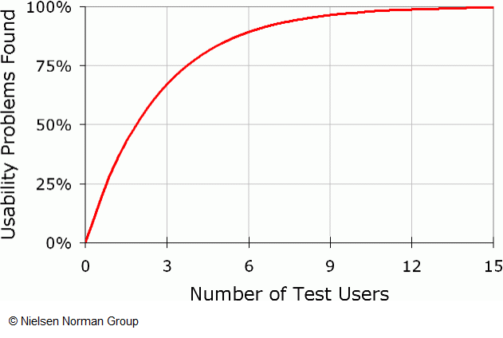

# Usabilidade - Como realizar testes de usabilidade?

Este guia prático tem como principal objetivo clarificar e documentar todos os conceitos e processos fundamentais para a realização dos testes de usabilidade de serviços públicos digitais na Administração Pública. Procura clarificar alguns conceitos fundamentais sobre os testes de usabilidade em si, garantindo o reconhecimento e real valor para qualquer produto em construção deste tipo de investimento de tempo e recursos.

## Como se caracterizam?

Os testes de usabilidade adotam vários modelos de realização. Mantendo aquilo que é a sua génese e foco de análise, escolhendo diferentes modelos com características próprias e que ajudam cada uma das equipas a melhor rentabilizar esta ferramenta de _user experience_ (UX).

Os testes de usabilidade, ajudam as equipas na avaliação da usabilidade, com dois tipos de análises diferentes: análises qualitativas ou análises quantitativas. Cada uma destas perspetivas tem as suas vantagens, ficando a cargo das equipas a decisão de qual faz sentido em cada momento do projeto.

### Análise Qualitativa

#### Pergunta a que responde

Porque os utilizadores fazem o que fazem?

#### Objetivos

Avaliação formativa:

* Identificar problemas de usabilidade;
* Ajudar a tomar decisões de _design_ informadas;
* Compreender contextos de utilização.

#### Utilização

Em qualquer momento do processo de design ou desenvolvimento.

#### Resultados

Descobertas baseadas na recolha, interpretações e impressões do facilitador, mas muito valiosas na compreensão dos utilizadores e do seu contexto.

#### Metodologia

Abordagem baseada:

* Realização de testes com poucos utilizadores;
* Condições de realização mais flexíveis e adaptáveis a diferentes circunstâncias;
* Utilização do _think aloud protocol_ para compreensão dos modelos mentais dos utilizadores.

### Análise Quantitativa

#### Pergunta a que responde

Quantos utilizadores fazem o que fazem?

#### Objetivos

Avaliação sumativa:

* Avaliar a usabilidade do produto digital;
* Ajudar a medir a usabilidade com base em métricas;
* Comparar produto com concorrente.

#### Utilização

Quando já existe um produto digital em funcionamento.

#### Resultados

Resultados estatisticamente significativos, mas impossíveis de contextualizar e compreender as suas causas.

#### Metodologia

Abordagem baseada:

* Envolvimento de muitos participantes;
* Controlo restrito de todas as condições do estudo;
* Focado na aferição de métricas numéricas concretas.

### Classificação

Os testes de usabilidade  (quer seja por uma análise qualitativa ou quantitativa), são uma ferramenta  que pode ainda ser classificada quanto ao seu formato propriamente dito, segundo dois vetores distintos:

* Testes de usabilidade moderados ou não moderados, referente à inclusão, ou não, na sua realização da presença de um facilitador que guie os utilizadores na execução das várias tarefas do teste;
* Testes de usabilidade realizados de forma presencial ou remota, referente ao espaço onde serão realizados os testes, se num espaço físico ou através de ferramentas de comunicação digital.

## Quando realizar?

Uma das coisas mais importantes a reter sobre os testes de usabilidade é a sua versatilidade de aplicação, quer seja no que pode testar, quer seja quando se pode testar.

Na verdade, em qualquer projeto de serviço público digital todos os momentos são bons para realizar testes de usabilidade. Embora tendo por base diferentes protótipos e por consequência as descobertas que estes podem originar, testar regularmente as soluções que estão a ser desenhadas e desenvolvidas é em muitos casos a chave para o sucesso.

Naturalmente que conforme a linha do tempo do projeto avança e a quantidade de artefactos e protótipos disponíveis aumenta, os ciclos de testes vão ficando mais completos, porque o detalhe do que pode ser testado aumenta também. Contudo, isto não pode querer dizer, que os testes de usabilidade só entram em cena no projeto numa fase já muito tardia.

  
  <h5>Relação entre Custo de mudança vs tempo (Scott Ambler)</h5>

 

A pior altura para realizar testes de usabilidade pela primeira vez no projeto é antes de lançamento da primeira versão do produto. Claro que é melhor realizar algum ciclo de testes do que nenhum, mas realizar testes de usabilidade numa fase tão tardia, vai fazer disparar exponencialmente os custos de alterações no produto.

Tendo isto em mente, é fundamental realizar testes de usabilidade regularmente, mas especialmente em fases iniciais dos projetos, para que seja possível não só manter algum espaço de experimentação de novas e inovadoras soluções, mas também controlar os custos de fazer alterações.

Quanto mais pensado e testado for o produto nas etapas de prototipagem, melhor será a sua definição e mais coesa a passagem para desenvolvimento. No final do dia, seja em que projeto for, estamos sempre a falar de poupanças de tempo e dinheiro.

## Com quantos utilizadores testar?

Uma das questões mais comuns quando se fala de testes de usabilidade é o número de utilizadores a envolver para a obtenção de resultados relevantes. Este tema do envolvimento é de grande importância, não só é fundamental que as conclusões que as equipas tomam se consubstanciam em evidências, mas também, porque o número de utilizadores a envolver tem um impacto direto no investimento que será necessário fazer na realização dos testes.

O número de utilizadores a envolver tem também subjacente no que toca aos testes de usabilidade, outra premissa a ponderar, porque depende do tipo de análise de usabilidade que se queira fazer.

Se o objetivo for fazer uma análise qualitativa da usabilidade serão necessários muitos menos utilizadores do que no caso de uma análise quantitativa. Se no caso das análises quantitativas, quantos mais utilizadores melhor, porque nos dará uma amostra mais robusta, no caso das análises qualitativas é preciso uma ponderação maior, porque o investimento de tempo na preparação e consolidação de conclusões é bem maior.

Posto isto, é fundamental, perceber qual o número de utilizadores mínimo a envolver em testes de usabilidade numa análise qualitativa. Um estudo da Nielsen Norman Group, uma das empresas de referência na área da usabilidade a nível mundial, refere que a partir dos 5 testes é possível encontrar quase 90% dos problemas de usabilidade do produto.

  
  <h5>Número de problemas encontrados vs Número de utilizadores que fazem testes (Nielsen Norman Group)</h5>

 

Sobre estas descobertas é importante clarificar que numa análise qualitativa da usabilidade, não se procura descobrir quantas pessoas encararam determinados problemas, mas sim descobrir que problemas existem. Se um utilizador encontrar um problema, ele continuará a ser um problema de usabilidade quer tenha sido encontrado por um ou por cinco utilizadores.

## Quais os documentos de referência?

A realização de testes de usabilidade, envolve alguma preparação e metodologia na execução das suas várias etapas. É importante que todo o processo seja documentado, não só para garantir que toda a equipa conhece os procedimentos, mas principalmente para garantir uma uniformização dos processos de avaliação ao longo do ciclo de vida do produto digital.

Para a realização de testes de usabilidade existem alguns materiais e documentos a ter como referência. Embora esta estrutura documental possa variar um pouco conforme o contexto e equipa, de uma maneira ou de outra, por norma é possível encontrar quase sempre o mesmo tipo de informação.

Os materiais e documentos de referência são os seguintes:

* **Plano de testes de usabilidade** - documento de definição fundamental dos testes que deve conter todas as diretivas principais de orientação;
* **Guião de tarefas** - resumo de todas as tarefas que serão solicitadas aos vários perfis de utilizadores para realizarem no serviço público digital. Conforme os perfis envolvidos nos testes poderá ser necessário ter documentos de guião diferentes;
* **Materiais de suporte aos testes** - todos os instrumentos, logísticos, tecnológicos ou documentais que vão apoiar a realização dos testes com os utilizadores;
* **Declaração de consentimento** - documento que comprova o consentimento dos utilizadores participantes nos testes para a recolha e tratamento da informação (vídeo e áudio) decorrente da realização dos testes;
* **Declaração de confidencialidade** - documento que comprova o compromisso por parte dos utilizadores participantes de manterem em sigilo toda a informação e modelos a que tiveram acesso durante a realização dos testes;
* **Relatório de conclusões** - documento resultante de todo o processo de testes, com uma estrutura e organização própria, que documenta todas as descobertas e aponta algumas sugestões de melhoria.

## Quem são os intervenientes?

A realização dos testes de usabilidade, neste caso em específico, requer a participação de vários tipos de intervenientes, cada qual com um papel e perfil específico.

### Facilitador

O Facilitador é a pessoa da equipa de projeto, com um perfil profissional relacionado com a área de UX, responsável por coordenar todo o plano de testes nas suas várias etapas.

Compete ao Facilitador:

* Preparar o plano dos testes de usabilidade e todos os protocolos necessários;
* Realizar o recrutamento e contacto com os participantes dos testes;
* Preparar todos os materiais, documentos e logística necessária para a realização dos testes;
* Guiar os participantes na realização dos testes;
* Analisar toda a informação recolhida durante os testes de usabilidade junto dos participantes;
* Redigir o relatório de conclusões;
* Apresentar as conclusões dos testes de usabilidade à equipa.

### Observador

O Observador, é a pessoa da equipa de projeto, de um qualquer perfil profissional interveniente no projeto, responsável por auxiliar o Facilitador durante a realização dos testes de usabilidade.

Compete ao Observador:

* Colaborar na preparação logística dos testes de usabilidade;
* Registar, durante os testes, para cada uma das tarefas o sucesso da conclusão da tarefa, o tempo de execução, principais dificuldades sentidas pelos utilizadores e sempre que possível o porquê dessas dificuldades;
* Registar, durante os testes, as impressões genéricas partilhadas pelos utilizadores;
* Auxiliar o Facilitador na redação do relatório de conclusões.

### Product Owner

O Product Owner, é a pessoa na estrutura de gestão da equipa de projeto, responsável por acompanhar, monitorizar e validar todo o trabalho realizado dentro da dinâmica dos testes de usabilidade, fazendo a ponte e relação disso com o decorrer do projeto.

Compete ao Product Owner:

* Definir o âmbito em termos de serviço público digital, das áreas a testar;
* Rever e aprovar o plano de testes de usabilidade;
* Difundir pela equipa de projeto as conclusões dos testes;
* Garantir a inclusão no _backlog_ do projeto e nos _sprints_ a realização das alterações subsequentes dos testes de usabilidade.

### Participantes

Os Participantes, são todos os utilizadores convidados a testar os protótipos do produto digital em avaliação e realizar as suas principais tarefas.

Compete aos Participantes:

* Participar nos testes de usabilidade;
* Garantir a confidencialidade de tudo o que lhes seja apresentado durante a realização dos testes.

## Qual a metodologia a seguir?

Para facilitar o planeamento, execução e conclusão do primeiro ciclo de testes de usabilidade é essencial definir o mais apuradamente possível, as várias tarefas deste processo de trabalho. Divididas essencial em três etapas de trabalho — antes, durante e depois — a metodologia por detrás da realização de qualquer estudo de testes necessita ser cuidada para garantir que não está a ficar esquecido.

Funcionando também como uma _checklist_ de controlo, este desenho metodológico, tenta elencar todas as tarefas essenciais por detrás das várias etapas do estudo.

### Antes da realização dos testes

Na etapa preparatória dos testes de usabilidade é importante não esquecer:

* Definir a equipa de trabalho para a realização do estudo;
* Definir o âmbito e objetivos dos testes;
* Definir os perfis de utilizadores a envolver no estudo;
* Preparar documento de “Plano de testes de usabilidade”;
* Preparar guiões de tarefas para cada perfil de utilizadores;
* Validar os documentos “Plano de testes de usabilidade” e guiões de tarefas;
* Preparar e rever protótipo a utilizar nos testes;
* Realizar um teste preparatório aos guiões de tarefas e protótipos (com pessoas da equipa de projeto);
* Recrutar os utilizadores participantes nos testes;
* Marcar data e hora para a realização de cada sessão de testes;
* Enviar mensagem com informação preparatória aos utilizadores participantes:
  * Nota introdutório sobre o que vai ser testado e o que se pretende com a realização deste estudo;
  * Data e hora;
  * Ligação da sessão remota;
  * Informação de que a sessão será gravada;
  * Informação de que a participação obriga a confidencialidade;
  * Pedir informação aos utilizadores participantes sobre o equipamento e _browser_ que vão utilizar na realização dos testes;
  * Enviar a declaração de confidencialidade para assinatura;
  * Enviar a declaração de consentimento para assinatura.
* Preparar documentos de declaração de confidencialidade e declaração de consentimento para a recolha de informação;
* Providenciar gratificações a entregar no final dos testes aos utilizadores;
* Preparar formulário online para o preenchimento no final do teste do _System Usability Scale_ (SUS);
* Preparar materiais, recursos, logística e ferramentas digitais necessárias;
* Confirmar com todos os utilizadores participantes, a data e hora da sua sessão de testes bem como se receberam a ligação da sessão online;
* Confirmar, antes da primeira sessão, todos os materiais, recursos, logística e ferramentas digitais.

### Durante a realização dos testes

Durante cada uma das sessões de testes é muito importante não esquecer:

* Receber o utilizador participante com uma nota de boas-vindas;
* Deixar os participantes o mais à vontade possívell;
* Realizar apresentações pessoais do Facilitador, Observador e Participante;
* Lembrar que não existem respostas certas ou erradas;
* Receber documentos de declaração de confidencialidade e declaração de consentimento;
* Gravar vídeo e áudio da sessão de testes;
* Explicar o que vai ser testado e quais os objetivos do estudo;
* Pedir aos utilizadores participantes para irem “pensando em voz alta” para que o Facilitador e    Observador possam ir acompanhando o raciocínio (_Think aloud protocol_);
* Realizar as várias tarefas do teste de usabilidade;
* Abrir espaço para comentários finais do utilizador participante àquilo que foi testado;
* Pedir para preencher o questionário online de SUS;
* Entregar a gratificação do teste;
* Encerrar a sessão de teste.

### Depois da realização dos testes

Após a realização de cada sessão de testes de usabilidade é essencial:

* Reunir gravações das sessões e notas do Observador numa mesma pasta de documentação;
* Analisar toda a informação resultante dos testes;
* Identificar os principais problemas de usabilidade encontrados pelos utilizadores participantes;
* Consolidar os dados recolhidos no questionário de SUS;
* Produzir o relatório de conclusões;
* Apresentar e discutir o relatório de conclusões com o _Product Owner_;
* Apresentar resultados e conclusões dos testes à equipa de projeto;
* Partilhar com a equipa de projeto o relatório de conclusões;
* Identificar quais as alterações a endereçar no imediato;
* Arquivar, numa pasta de documentação partilhada, toda a informação resultante dos estudos;
* Avaliar e documentar a metodologia seguida no estudo de testes de usabilidade.

### _Think aloud protocol_

Na realização de testes de usabilidade moderados, presenciais ou _remote_, o _think aloud protocol_, é uma ferramenta muito interessante para perceber tudo o vai “passando pela cabeça” dos utilizadores.

Este instrumento, passa por incentivar o utilizador, conforme vai realizando cada uma das tarefas que lhe são propostas a dizer em voz alta tudo o que está a pensar, as suas dúvidas, indecisões, sugestões, etc.

O pensamento em voz alta, ajuda não só o Facilitador a conseguir compreender um pouco melhor as ações dos utilizadores em cada momento, mas também é um bom instrumento para detetar em que pontos da experiência os utilizadores possam ter mais dúvidas, mesmo que completem com sucesso a tarefa.

### _System Usability Scale_ (SUS)

A _System Usability Scale_ (SUS) é uma ferramenta complementar à realização das várias tarefas dos testes de usabilidade que ajuda a medir e quantificar a qualidade da usabilidade do produto digital. Consiste num questionário com 10 perguntas, realizado no final de todas as tarefas do teste de usabilidade. A cada uma das questões o utilizador responde numa escala com 5 degraus que vai entre “Concordo totalmente” ou “Discordo totalmente”.

Criado originalmente por John Brooke em 1986, este instrumento avalia, em muitos contextos de projetos diferentes, a sensação do utilizador face à usabilidade — eficácia, eficiência e satisfação — do serviço digital que acabou de testar.

Embora seja uma ferramenta baseada na opinião dos utilizadores, é mais um bom instrumento, quando utilizado em articulação com outras métricas de usabilidade, para quantificar a qualidade da usabilidade do produto em desenvolvimento.

No final dos testes de usabilidade o utilizador recebe um endereço para um formulário online onde poderá preencher o SUS.

As questões que devem ser incluídas são as seguintes:

1\.      Eu acho que gostaria de usar este portal com frequência.

2\.     Eu acho o portal desnecessariamente complexo.

3\.     Eu achei o portal fácil de usar.

4\.     Eu acho que precisaria de ajuda de uma pessoa com conhecimentos técnicos para usar o   &#x20;

&#x20;       portal.

5\.     Eu acho que as várias opções do portal estão muito bem integradas.

6\.     Eu acho que o portal apresenta muita inconsistência.

7\.     Eu imagino que as pessoas aprenderão como usar este portal rapidamente.

8\.     Eu achei o portal difícil de usar.

9\.     Eu senti-me confiante ao usar o portal.

10\.   Eu precisei de aprender várias coisas novas antes de conseguir usar o portal.

No final de todos os testes, todas as respostas dos utilizadores são introduzidas numa folha de cálculo pré-preparada que calcula e atribui a classificação SUS do portal. As conclusões do SUS devem também ser incluídas no relatório de conclusões final.

## Quais os materiais de suporte necessários?

Para a realização deste estudo de testes de usabilidade, serão necessários alguns materiais, recursos, logística e ferramentas digitais que é necessário acautelar, principalmente na etapa da metodologia “antes da realização dos testes”.

Assim sendo, será necessário garantir a preparação dos seguintes materiais:

* Mensagem de email preparatória a enviar aos utilizadores participantes;
* Modelo de declaração de confidencialidade;
* Modelo de declaração de consentimento;
* Protótipos para a realização dos testes
* Documentos Google Docs online separados com cada uma das tarefas e ligações para o        protótipo a utilizar pelos utilizadores participantes;
* Modelo de formulário online para o preenchimento por parte dos participantes do SUS;Modelo de folha de cálculo para o cálculo da classificação de SUS;
* Gratificações para entregar aos utilizadores participantes no final dos testes.

## Ferramentas digitais

O Zoom é a aplicação online sugerida para a realização das sessões de testes online. Permite entre muitas outras coisas uma excelente comunicação entre todos os intervenientes, gravação do vídeo e áudio das sessões para além de garantir uma performance e fluidez na comunicação muito acima das aplicações concorrentes.

O Google Docs, em especial a sua versão de criação de documentos online, é a ferramenta ideal, para a partilha durante a sessão de testes de todas as tarefas que os utilizadores participantes terão que realizar.

O Google Forms é a aplicação para a criação de formulários online sugerida para a criação do questionário a partilhar com os utilizadores participantes no final da sessão de testes para preenchimento do SUS.

## O que deve incluir o relatório de conclusões?

Para conclusão do primeiro ciclo de testes de usabilidade deve ser redigido um relatório contendo todas as conclusões e impressões partilhadas pelos utilizadores. Este documento, que se quer o mais simples e sintético possível, deve incluir não só a informação quantitativa e balanço da realização das tarefas, mas também todos os contributos qualitativos partilhados.

Para além de tudo isto, é muito importante que o relatório aponte algumas sugestões de melhorias para os principais problemas de usabilidade encontrados, bem como uma hierarquia de importância e grau de gravidade.

Sugere-se que o relatório de conclusões inclua as seguintes métricas e conteúdos:

* Para cada tarefa de cada guião de tarefas:
  * Taxa de tarefas concluídas;
  * Taxa de tarefas não concluídas;
  * Tempo médio de realização de cada tarefa;
  * Necessidade de ajuda durante a tarefa.
* Ideias soltas partilhadas pelos utilizadores durante a realização de cada tarefa (_think aloud protocol_);
* Resumo dos principais problemas de usabilidade identificados e sugestão de melhorias por cada área temática ou página:
  * Identificação do problema
  * Localização do problema no produto
  * Sugestão de melhoria
  * Classificação de severidade
* Definição dos níveis da escala de severidade;
* Resumo e classificação do SUS obtido.

Na edição desde relatório é fundamental serem criados resumos dos principais conteúdos para que se torne bastante fácil de ler e ser revisitado várias vezes ao longo do desenvolvimento do projeto.
