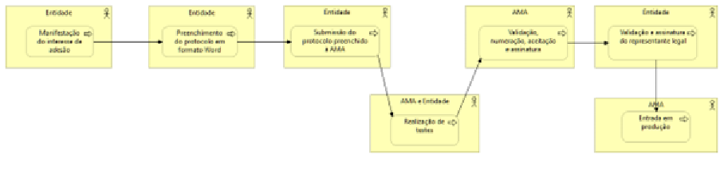

# Qual o processo de adesão?

O processo abaixo apenas se refere à adesão por parte da entidade à assinatura com Chave Móvel Digital. Para a utilização da assinatura com o Cartão do Cidadão, não há necessidade de celebrar qualquer protocolo com a AMA.

  
  <h5>Processo de adesão Assinatura Digital</h5>

 

Os passos para estabelecimento do protocolo são os seguintes:

| Passo                                                | Entidade Responsável    | Descrição                                                                                                                                                                                                                       |
| ---------------------------------------------------- | ----------------------- | ------------------------------------------------------------------------------------------------------------------------------------------------------------------------------------------------------------------------------- |
| **1.** Manifestação do interesse de adesão           | Entidade Aderente       | Manifestação do interesse de adesão da entidade à AMA preenchendo o [formulário online](https://www.autenticacao.gov.pt/web/guest/integracao-entidade).                                                                         |
| **2.** Preenchimento do protocolo                    | Entidade Aderente       | Preenchimento do protocolo enviado pela AMA à entidade.                                                                                                                                                                         |
| **3.** Submissão do _template_ à AMA                 | Entidade Aderente       | Submissão do template preenchido à AMA, sem assinatura.                                                                                                                                                                         |
| **4.** Realização de testes                          | AMA e Entidade Aderente | A realização de testes poderá ser iniciada antes da respetiva assinatura. Para isso, é necessário enviar um email para a equipa [eid@ama.pt](mailto:eid@ama.pt) e seguir as orientações da documentação indicada no protocolo.  |
| **5.** Validação, numeração, aceitação e assinatura  | AMA                     | Validação, numeração, aceitação e assinatura pelo Conselho Diretivo da AMA.                                                                                                                                                     |
| **6.** Validação e assinatura do representante legal | Entidade Aderente       | Validação e assinatura do representante legal (ou representantes legais aplicáveis, de acordo com o descrito na Certidão Permanente) da entidade aderente.                                                                      |
| **7.** Entrada em Produção                           | AMA                     | Entrada em Produção do serviço de assinatura com CMD. A assinatura do protocolo por ambas as partes é obrigatória para acesso ao serviço de assinatura com CMD em produção.                                                     |

