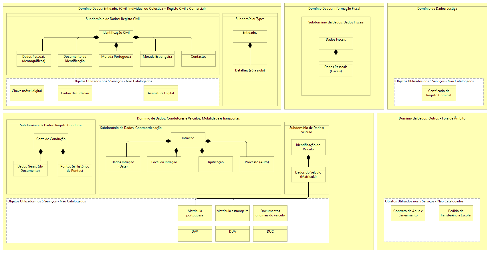

# Quais os dados utilizados nos serviços de nova geração?

Os dados mestre que serviram de base a este mapeamento são os que estão catalogados no Catálogo de Dados da AMA.

Os objetos de dados e as respetivas características, propriedades e eventuais agrupamentos são geridos neste catálogo, que deve ser a fonte a consultar para mais informação sobre objetos de dados.

Este catálogo de dados, é o que é utilizado por todos os novos serviços digitais, para reger todas as interações dos mesmos com objetos de dados.

  

 
