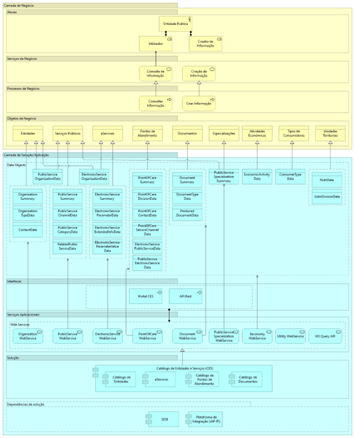

# Como está estruturada a plataforma?

Abaixo o diagrama de alto nível do CES, demonstrando na Camada de Negócio os atores e papéis envolvidos, os serviços de negócio e os processos relacionados, assim como os objetos de negócio associados a estes processos e serviços de negócio.

Na Camada Aplicacional estão representados os objetos de dados que realizam os objetos de negócio, os serviços aplicacionais (webservices) que realizam os processos de negócio, assim como as respetivas interfaces dos serviços aplicacionais.

Este bloco de construção tem dependência com outro bloco de contrução (iAP-PI), para disponibilizar algumas das suas funcionalidades, e também com outra aplicação (SIOE). Esta representação é mostrada no diagrama como “dependências da solução”.

  
  
Diagrama de alto nível do CES

 

