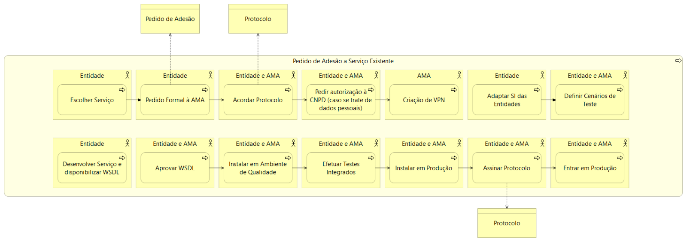
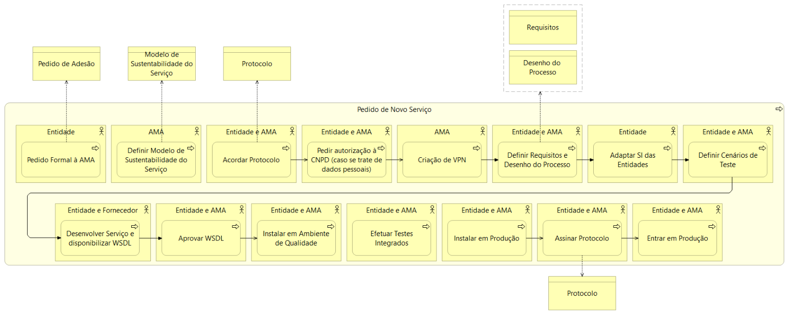

# Qual o processo de adesão?
## Consulte o processo de adesão para um serviço existente ou um serviço novo.

## Processo de Adesão a Serviço Existente

  
  <h5>Processo de adesão a um serviço existente na iAP-PI</h5>

 

| Passo                                             | Entidade Responsável | Descrição                                                                                                                                                                                                                                                                        |
| ------------------------------------------------- | -------------------- | -------------------------------------------------------------------------------------------------------------------------------------------------------------------------------------------------------------------------------------------------------------------------------- |
| **1.** Selecionar o serviço que pretende consumir | Entidade             | Escolha o serviço pretendido do [catálogo de serviços](https://www.iap.gov.pt/web/iap/plataforma-de-integracao) disponíveis na PI.                                                                                                                                               |
| **2.** Pedido de adesão formal à AMA              | AMA                  | Preencha o [formulário de adesão](https://www.iap.gov.pt/web/iap/formulario-de-adesao?serviceId=3) a indicar o(s) serviço(s) a consumir, se possível uma estimativa do volume de invocações e o enquadramento legal para obter a informação pretendida.                          |
| **3.** Acordar protocolo entre entidades          | Entidade e AMA       | Acordar protocolo entre as partes envolvidas no pedido de autorização. Caso exista recolha ou transmissão de dados pessoais deverá ser efetuado um pedido de autorização à Comissão Nacional de Proteção de Dados (CNPD) para disponibilização dos dados à entidade consumidora. |
| **4.** Pedir autorização à CNPD                   | Entidade e AMA       | Caso exista recolha ou transmissão de dados pessoais deverá ser efetuado um pedido de autorização à Comissão Nacional de Proteção de Dados (CNPD) para disponibilização dos dados à entidade consumidora.                                                                        |
| **5.** Criação de VPN                             | AMA                  | Estabelecimento da ligação à Plataforma de Interoperabilidade através de Virtual Private Network (VPN) permanente (mais informação em Ligação VPN).                                                                                                                              |
| **6.** Adaptar SI das entidades                   | Entidade aderente    | Adaptação dos sistemas de informação (SI) das entidades aderentes para integrar os dados do serviço.                                                                                                                                                                             |
| **7.** Definir cenários de teste                  | Entidade e AMA       | Definição dos cenários de teste.                                                                                                                                                                                                                                                 |
| **8.** Desenvolver Serviço e disponibilizar WSDL  | Entidade             | Caso o serviço ainda não esteja disponível é necessário o seu desenvolvimento pela entidade fornecedora e a disponibilização do Web Services Description Language (WSDL), ficheiro responsável pela descrição, métodos e operações do serviço.                                   |
| **9.** Aprovar WSDL                               | Entidade e AMA       | Aprovação dos WSDL.                                                                                                                                                                                                                                                              |
| **10.** Instalar ambiente de Qualidade            | Entidade e AMA       | Instalação do serviço em ambiente de qualidade.                                                                                                                                                                                                                                  |
| **11.** Efetuar Testes Integrados                 | Entidade e AMA       | Testes integrados do serviço.                                                                                                                                                                                                                                                    |
| **12.** Instalar em Produção                      | Entidade e AMA       | Instalação do serviço em produção.                                                                                                                                                                                                                                               |
| **13.** Assinar protocolo                         | Entidade e AMA       | Assinatura do protocolo acordado entre as partes. Entrada em produção do serviço após validação de todos os requisitos técnicos, jurídicos e de privacidade.                                                                                                                     |
| **14.** Entrar em Produção                        | Entidade e AMA       | Entrada em produção do serviço após validação de todos os requisitos técnicos, jurídicos e de privacidade.                                                                                                                                                                       |

## Processo de Adesão a Novo Serviço

  
  <h5>Desenho do Processo de adesão a um novo serviço na iAP-PI</h5>

 

| Etapa                                         | Entidade responsável | Descrição                                                                                                                                                                                                                                               |
| --------------------------------------------- | -------------------- | ------------------------------------------------------------------------------------------------------------------------------------------------------------------------------------------------------------------------------------------------------- |
| Selecionar o serviço que pretende consumir.   | Entidade             | Escolha o serviço pretendido do [catálogo de serviços](https://www.iap.gov.pt/web/iap/plataforma-de-integracao) disponíveis na PI.                                                                                                                      |
| Pedido de adesão formal à AMA.                | AMA                  | Preencha o [formulário de adesão](https://www.iap.gov.pt/web/iap/formulario-de-adesao?serviceId=3) a indicar o(s) serviço(s) a consumir, se possível uma estimativa do volume de invocações e o enquadramento legal para obter a informação pretendida. |
| Definir Modelo de Sustentabilidade do Serviço | AMA                  | Definição do modelo de sustentabilidade do serviço pela AMA.                                                                                                                                                                                            |
| Acordar protocolo entre entidades             | Entidade e AMA       | Acordar protocolo entre as partes envolvidas no pedido de autorização.                                                                                                                                                                                  |
| Pedir autorização à CNPD                      | Entidade e AMA       | Caso exista recolha ou transmissão de dados pessoais deverá ser efetuado um pedido de autorização à CNPD para disponibilização dos dados à entidade consumidora.                                                                                        |
| Criação de VPN                                | AMA                  | Estabelecimento da ligação à Plataforma de Interoperabilidade através de VPN permanente (mais informação em Ligação VPN).                                                                                                                               |
| Definir Requisitos e Desenho do Processo      | Entidade e AMA       | Definição dos requisitos para o serviço e desenho do processo.                                                                                                                                                                                          |
| Adaptar SI das entidades                      | Entidade aderente    | Adaptação dos SI das entidades aderentes para integrar os dados do serviço.                                                                                                                                                                             |
| Definir cenários de teste                     | Entidade aderente    | Definição dos cenários de teste.                                                                                                                                                                                                                        |
| Desenvolver Serviço e disponibilizar WSDL     | Entidade e AMA       | Caso o serviço ainda não esteja disponível é necessário o seu desenvolvimento pela entidade fornecedora e a disponibilização do WSDL, ficheiro responsável pela descrição, métodos e operações do serviço.                                              |
| Aprovar WSDL                                  | Entidade             | Aprovação dos WSDL.                                                                                                                                                                                                                                     |
| Instalar em Ambiente de Qualidade             | Entidade e AMA       | Instalação do serviço em ambiente de qualidade.                                                                                                                                                                                                         |
| Efetuar Testes Integrados                     | Entidade e AMA       | Testes integrados do serviço.                                                                                                                                                                                                                           |
| Instalar em Produção                          | Entidade e AMA       | Instalação do serviço em produção.                                                                                                                                                                                                                      |
| Assinar protocolo                             | Entidade e AMA       | Assinatura do protocolo acordado entre as partes.                                                                                                                                                                                                       |
| Entrar em Produção                            | Entidade e AMA       | Entrada em produção do serviço após validação de todos os requisitos técnicos, jurídicos e de privacidade.                                                                                                                                              |
