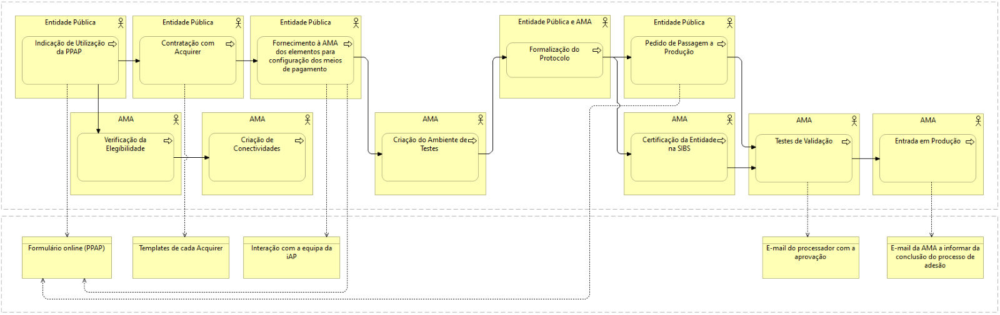

# Qual o processo de adesão?

A adesão à PPAP – Plataforma de Pagamentos da Administração Pública, no âmbito do Licenciamento Zero segue o seguinte fluxo, gerido no portal online da PPAP, complementado pela contratação entre a Entidade Aderente e as Entidades de Suporte aos meios de pagamento.

  
  Processo de adesão à Plataforma de Pagamentos da AP

 

<table>
<caption></caption>
  <tr>
    <th >Passo</th>
    <th >Entidade Responsável</th>
    <th >Descrição</th>
  </tr>
  <tr>
    <td><strong>1.</strong> Pedido de adesão formal à AMA</td>
    <td>Entidade Aderente</td>
    <td>Preencha o <a href="https://www.iap.gov.pt/web/iap/formulario-de-adesao?serviceId=2">formulário de adesão</a> a indicar o(s) serviço(s) a consumir, se possível uma estimativa do volume de invocações e o enquadramento legal para obter a informação pretendida.</td>
  </tr>
  <tr>
    <td><strong>2.</strong>Verificação da Elegibilidade</td>
    <td>AMA</td>
    <td>Verificação, pela AMA, da efetiva elegibilidade da Entidade para utilização da PPAP.</td>
  </tr>
  <tr>
    <td><strong>3.</strong>Contratação com _Acquirer_</td>
    <td>Entidade Aderente</td>
    <td>Contratação dos meios de pagamento às entidades que os disponibilizam.</td>
  </tr>
  <tr>
    <td><strong>4.</strong>Fornecimento à AMA dos elementos para configuração dos meios de pagamento</td>
    <td>Entidade Aderente</td>
    <td>Disponibilização de informação sobre a Entidade Aderente e sobre os meios de pagamento que pretende utilizar.</td>
  </tr>
  <tr>
    <td><strong>5.</strong> Criação de conectividades</td>
    <td>AMA</td>
    <td>Criação pela AMA, das conectividades à PPAP, caso a entidade não tenha.</td>
  </tr>
  <tr>
    <td><strong>6.</strong>Criação do Ambiente de Testes</td>
    <td>AMA</td>
    <td>Criação do ambiente de teste da Entidade, na PPAP.</td>
  </tr>
  <tr>
    <td><strong>7.</strong> Formalização do Protocolo</td>
    <td>AMA e Entidade Aderente</td>
    <td>Assinatura do protocolo redigido pela AMA (que possibilita a certificação da Entidade Aderente junto da SIBS).</td>
  </tr>
  <tr>
    <td><strong>8.</strong> Pedido de Passagem a Produção</td>
    <td>Entidade Aderente</td>
    <td>Pedido de Passagem a Produção.</td>
  </tr>
  <tr>
    <td><strong>9.</strong>Certificação da Entidade na SIBS</td>
    <td>AMA</td>
    <td>Certificação da Entidade na SIBS, com base no protocolo assinado.</td>
  </tr>
  <tr>
    <td><strong>10.</strong> Testes de Validação</td>
    <td>AMA</td>
    <td>Testes de Validação / Certificação.</td>
  </tr>
  <tr>
    <td><strong>11.</strong> Entrada em Produção</td>
    <td>AMA</td>
    <td>Entrada em Produção.</td>
  </tr>
</table>

