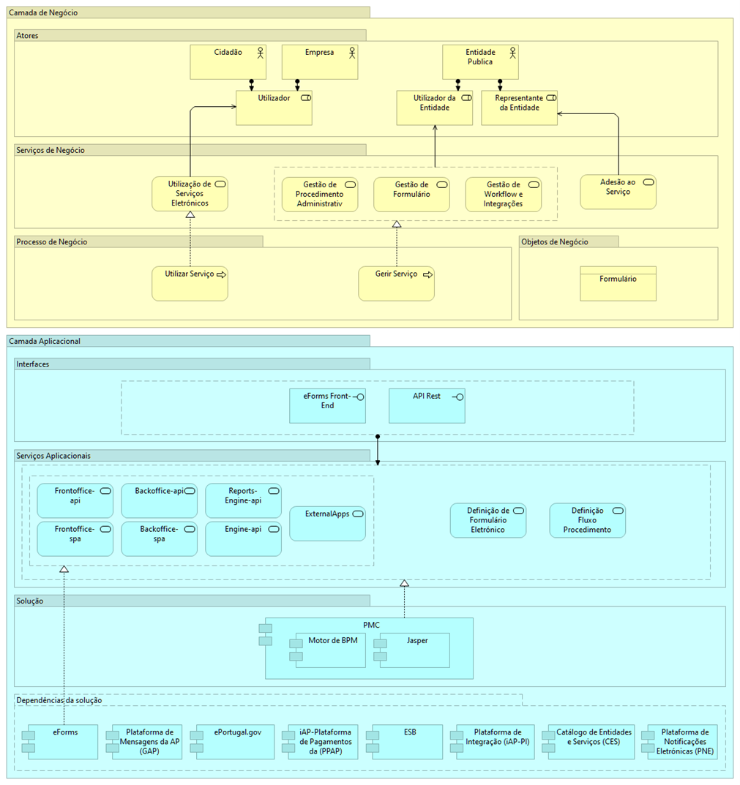

# Como está estruturada a plataforma?

Abaixo o diagrama de alto nível da PMC, demonstrando na Camada de Negócio os atores e papéis envolvidos, os serviços de negócio e os processos relacionados, assim como os objetos de negócio associados a estes processos e serviços de negócio.

Na Camada Aplicacional estão representados os serviços aplicacionais que realizam os processos de negócio, assim como as respetivas interfaces dos serviços aplicacionais.

Este bloco de construção tem dependência com outros blocos de construção (eForms, Gateway de SMS, ePortugal, Plataforma de Pagamentos, iAP-PI, Catálogo de Entidades e Serviços, e Plataforma de Notificações Eletrónicas), e também com a solução _Enterprise Service Bus_ (ESB).

  
  Diagrama de Arquitetura alto nível PMC

 
