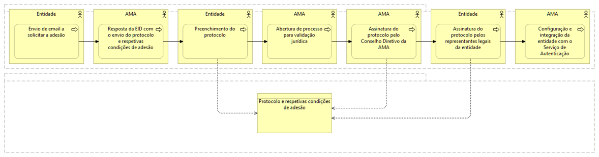

# Qual o processo de adesão?

Para a adesão ao com o Serviço de Autenticação deverá seguir os procedimentos:

  
  <h5>Processo de adesão ao com o Serviço de Autenticação</h5>

 

<!-- Table Content -->
<table>
  <tr>
    <th style="background-color: #f2f2f2; padding: 10px;">Passo</th>
    <th style="background-color: #f2f2f2; padding: 10px;">Entidade Responsável</th>
    <th style="background-color: #f2f2f2; padding: 10px;">Descrição</th>
  </tr>
  <tr>
    <td><strong>1.</strong></td>
    <td>Entidade Aderente</td>
    <td>Efetue um contacto formal comunicando o interesse através do <a href="https://www.autenticacao.gov.pt/web/guest/integracao-entidade">formulário online</a>.</td>
  </tr>
  <tr>
    <td><strong>2.</strong></td>
    <td>AMA</td>
    <td>Resposta da EID com o envio do protocolo e respetivas condições de adesão.</td>
  </tr>
  <tr>
    <td><strong>3.</strong></td>
    <td>Entidade Aderente</td>
    <td>Preenchimento do protocolo por parte da entidade e envio para: <a href="mailto:eid@ama.pt">eid@ama.pt</a>.</td>
  </tr>
  <tr>
    <td><strong>4.</strong></td>
    <td>AMA</td>
    <td>Abertura de processo para validação jurídica.</td>
  </tr>
  <tr>
    <td><strong>5.</strong></td>
    <td>AMA</td>
    <td>Assinatura do protocolo pelo Conselho Diretivo da AMA.</td>
  </tr>
  <tr>
    <td><strong>6.</strong></td>
    <td>Entidade Aderente</td>
    <td>Assinatura do protocolo pelos representantes legais da entidade.</td>
  </tr>
  <tr>
    <td><strong>7.</strong></td>
    <td>AMA e Entidade Aderente</td>
