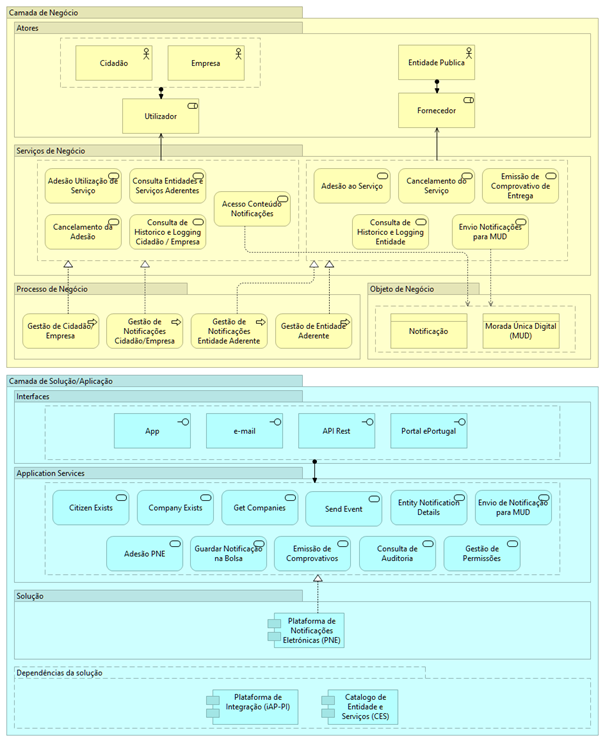

# Como está estruturada a plataforma?

O SPNE (Serviço Público de Notificações Eletrónicas) e a MUD (Morada Única Digital) a ele associada, foram implementados através de um sistema informático de suporte, a Plataforma de Notificações Eletrónicas (PNE) a gerir pela AMA, IP.

Abaixo o diagrama de alto nível do SPNE, demonstrando na Camada de Negócio os atores e papéis envolvidos, os serviços de negócio e os processos relacionados, assim como os objetos de negócio associados a estes processos e serviços de negócio.

Na Camada Aplicacional estão representados os serviços aplicacionais que realizam os processos de negócio, assim como as respetivas interfaces dos serviços aplicacionais.

Este bloco de construção tem dependência com outros blocos de construção (iAP e CES), para disponibilizar algumas das suas funcionalidades. Esta representação é mostrada no diagrama como “dependências da solução”.

  
  Diagrama de Arquitetura de alto nível SPNE

 

## Requisitos de implementação da PNE

A arquitetura da PNE foi baseada nos seguintes requisitos:

* Utilização de métodos de autenticação forte baseados no CC e/ou Chave Móvel Digital (CMD) para os cidadãos e estes associados à certificação de atributos profissionais (SCAP) para os representantes das empresas;
* Comunicação com as entidades aderentes através da Plataforma de Interoperabilidade da Administração Pública (iAP) garantindo a segurança e confidencialidade de todas as mensagens trocadas entre entidades e PNE;
* Identificação dos cidadãos e das empresas com recurso à federação de identidades garantindo a confidencialidade destes;
* Transmissão e arquivo da informação encriptada garantindo a confidencialidade do conteúdo das notificações;
* Segregação do registo da MUD garantindo a proteção dos dados pessoais dos cidadãos;
* Capacidade de processamento garantindo bons níveis de serviço mesmo em situações especiais de envio de grandes volumes de notificações;
* Garantia de implementação de recomendações e boas práticas de segurança quer ao nível de desenvolvimento aplicacional quer ao nível de administração e gestão de sistemas e comunicações.
