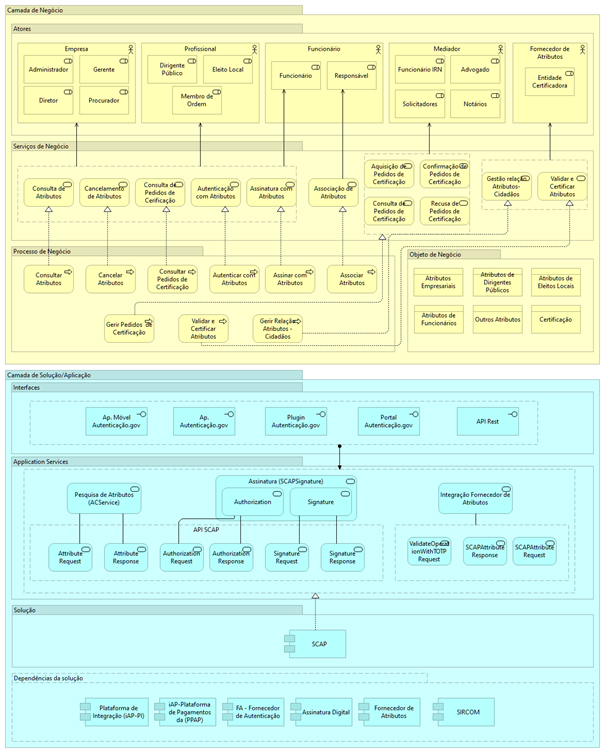
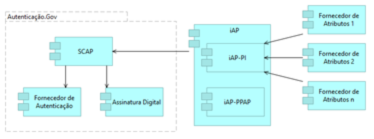

# Como está estruturada a plataforma?

Abaixo o diagrama de alto nível do SCAP, demonstrando na Camada de Negócio os atores e papéis envolvidos, os serviços de negócio e os processos relacionados, assim como os objetos de negócio associados a estes processos e serviços de negócio.&#x20;

Na Camada Aplicacional estão representados os serviços aplicacionais que realizam os processos de negócio, assim como as respetivas interfaces dos serviços aplicacionais.&#x20;

Este bloco de construção tem dependência com outros blocos de contrução (iAP e Portal Autenticação.gov), para disponibilizar algumas das suas funcionalidades, e também de outras aplicações externas (SIRCOM e Fornecedor de Atributos). Esta representação é mostrada no diagrama como “dependências da solução”.&#x20;

  
  Diagrama de Arquitetura alto nível do SCAP

 

### Autenticação

A autenticação com atributos profissionais permite ao cidadão confirmar de forma segura a sua identidade na qualidade de profissional junto de entidades públicas e privadas.

Para se autenticar, tem primeiro de associar os atributos profissionais que se aplicam às suas funções ou cargo: atributos empresariais, atributos dirigentes públicos, ou atributos Eleitos Locais.

Pode autenticar-se com atributos profissionais através de:

·       Cartão de Cidadão

ou

·       Chave Móvel Digital

Estes atributos profissionais são reconhecidos ao cidadão por uma Ordem ou Entidade.

### Assinatura

O profissional poderá também assinar documentos digitais na qualidade ou poderes das funções que desempenha. Para isso terá de associar atributos profissionais. Depois de os associar poderá assinar digitalmente como profissional, através de Cartão de Cidadão ou Chave Móvel Digital.

Os atributos profissionais podem ser:

* **Atributos Dirigentes Públicos**: cargo ou função de dirigente público
* **Atributos Eleitos Locais**: cargo ou função de Eleito Local
* **Atributos Empresariais:** administrador, gerente, diretor ou procurador de uma empresa

### Estrutura da Solução

A comunicação entre o SCAP e os Fornecedores de Atributos é feita de forma assíncrona e é despoletada pelo SCAP.

  
  Integração do SCAP

 
O SCAP envia um pedido de consulta de atributos ao Fornecedor de Atributos de um cidadão, o Fornecedor de Atributos efetua o processamento do pedido e invoca, sequencialmente, um serviço da iAP com a resposta ao pedido de atributos e outro serviço para validação da operação. Este último serviço só pode ser invocado se o cidadão tiver atributos ativos.

É ao SCAP que compete disponibilizar aos utilizadores finais as funcionalidades de autenticação e assinatura digital com atributos profissionais. É também o SCAP que inicia a comunicação com os Fornecedores de Atributos, para que estes certifiquem os respetivos atributos profissionais.

A plataforma de Interoperabilidade da Administração Pública (iAP) atua como intermediária num universo de sistemas e tecnologias heterogéneas e é responsável pela interligação do SCAP com os Fornecedores de Atributos.

Esta plataforma é baseada numa arquitetura orientada aos serviços (SOA), em que as funcionalidades são disponibilizadas através de web services SOAP assíncronos. Atendendo aos requisitos de segurança, e sensibilidade das informações transacionadas, todas a comunicações entre o SCAP, iAP e os Fornecedores de Atributos é efetuada através do protocolo HTTPS.

Em resumo, a articulação com a iAP é suportada através dos seguintes protocolos:

·       Comunicação – HTTP/ HTTPS via VPN;

·       Especificação de mensagens – SOAP;

Extensões para garantir o assincronismo – WS-Addressing.
