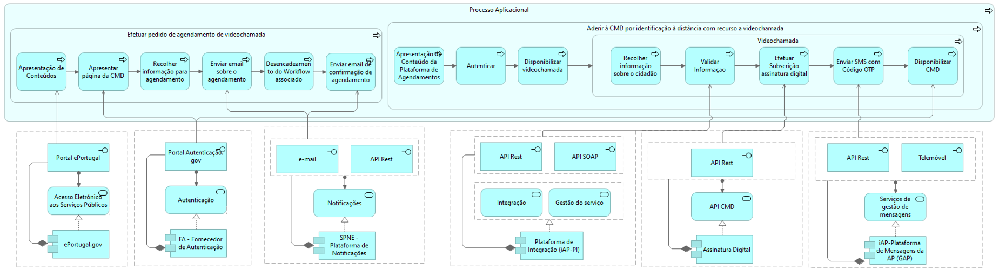

# Ativar CMD com recurso a biometria via Videochamada

Descrição da Arquitetura do Serviço Digital
{: .fs-5 .fw-300 }

O novo serviço digital “Ativação da chave móvel digital com recurso a biometria via videochamada”, será mais uma opção disponibilizada ao cidadão, no site Autenticação.Gov, para ativar a sua Chave Móvel Digital. Esta opção será disponibilizada via identificação à distância do cidadão, com recurso a videochamada, sendo o processo conduzido por um Operador do Centro de Contato da Linha Cidadão, com auxílio de ferramentas automáticas de reconhecimento facial e de leitura automática dos dados do Cartão de Cidadão, para validação da identidade do requerente.

## Partes interessadas

### AMA

A Agência para Modernização Administrativa é o instituto público responsável pela promoção e desenvolvimento da modernização administrativa em Portugal. A sua atuação divide-se em três eixos: atendimento, transformação digital e inovação e participação, e encontra-se sob superintendência e tutela do Secretário de Estado da Digitalização e da Modernização Administrativa.

É responsável pelas Plataformas Comuns utilizadas e pelo serviço que descrito neste documento.

### IRN

O Instituto dos Registos e do Notariado é um instituto público que executa e acompanha as políticas relativas aos serviços de registo, tendo em vista assegurar a prestação de serviços aos cidadãos e às empresas no âmbito da identificação civil e do registo civil, de nacionalidade, predial, comercial, de bens móveis e de pessoas coletivas. O IRN assegura, ainda, a regulamentação, o controlo e a fiscalização da atividade notarial.

No processo de Ativação de CMD com recurso a biometria, os dados fornecidos pelo cidadão deverão ser validados, através da comparação destes com os dados do cidadão no IRN.

### Visão da Arquitetura

A Chave Móvel Digital (CMD) é um meio de autenticação e assinatura digital certificado pelo Estado português, que permite ao utilizador autenticar-se em vários portais públicos ou privados, e assinar documentos digitais, com assinatura eletrónica qualificada.

A todo o cidadão é permitida a associação do seu número de identificação civil a um único número de telemóvel, podendo também associar o seu endereço de correio eletrónico. No caso de cidadão estrangeiro que não tenha número de identificação civil1, a associação é efetuada através do número de identificação fiscal constante do título de residência ou do cartão de residência, ou ainda através do respetivo número de passaporte.

O sistema é composto por uma palavra-chave permanente, distinta para a autenticação e assinatura, escolhida e alterável pelo utilizador, bem como por um código numérico de utilização única e temporária por cada autenticação ou assinatura.

Este código numérico de utilização única e temporária é gerado automaticamente pelo sistema da CMD, aquando da introdução da identificação do utilizador e da palavra-chave a ela associada. Estecódigo numérico é enviado por _Short Message Service (SMS)_ para o respetivo número de telemóvel ou, por push notification para a aplicação móvel (app) Autenticação.Gov (preferencial) registada pelo utilizador.

Qualquer cidadão pode pedir a ativação da sua CMD presencialmente, num Balcão de Atendimento, ou no momento de levantamento de um novo cartão de cidadão.

Pode também ativar a sua CMD online, acedendo ao site Autenticação.Gov, e escolhendo uma das seguintes opções:

1. Ativar CMD com cartão de cidadão – Neste caso, é necessário possuir um leitor de cartões e o código PIN de autenticação do cartão de cidadão.
2. Ativar CMD via Portal das Finanças – Neste caso, é necessário o NIF e senha de acesso ao Portal das Finanças. Após o pedido, é enviada uma carta com um PIN temporário, para a morada do titular do cartão de cidadão, que permite concluir a ativação da CMD.

O novo serviço digital “Ativação da chave móvel digital com recurso a biometria, via videochamada”, será mais uma opção disponibilizada ao cidadão, no site Autenticação.Gov, para ativar a sua CMD.

O processo de ativação da CMD com recurso a biometria através de videochamada, é realizado por dois intervenientes. O cidadão, enquanto requerente do serviço, e o operador do centro de contato da Linha Cidadão, que através de videochamada irá guiar o cidadão ao longo do todo processo de ativação da CMD.

O cidadão, ao aceder ao portal ePortugal e escolher o serviço Chave Móvel Digital, é redirecionado para a página da CMD no site Autenticação.Gov. Aqui, estará disponível a nova opção de ativação da CMD por videochamada. O cidadão terá de preencher alguns dados essenciais ao processo: nome, email e número de telemóvel; e terá ao dispor um calendário, para escolher o dia e hora da videochamada, mediante os horários disponíveis. Após preencher a informação, receberá uma mensagem de email, que solicita a confirmação do seu email, através de um link no corpo da mensagem. Após esta confirmação, o cidadão receberá um segundo email que confirma o agendamento.

No dia agendado, o cidadão terá de aceder ao link enviado no email de confirmação, de modo a ser redirecionado para o serviço de videochamada. Após aceitar os termos e condições e, o operador aceitar a videochamada, esta terá início. Ao longo do processo, o operador irá tirar fotografias ao cartão de cidadão e ao cidadão, e estas serão validadas face aos dados registados no sistema do IRN. O cidadão deve indicar também se pretende ativar o serviço de Assinatura Digital. Por fim, receberá um SMS com um código OTP para confirmar o seu número de telefone, e após comunicá-lo ao operador o processo é concluído e a CMD ativada.

Do lado do operador, o processo de adesão envolve principalmente a gestão de agendamentos e comunicação com o cidadão. O operador deverá aceder à Plataforma de Agendamento onde poderá consultar os agendamentos que tem afetados a si. Após escolher um agendamento, deve autenticar-se com as suas credenciais de modo a atender as chamadas que lhe estão assignadas. Ao longo da videochamada, deverá capturar o cartão de cidadão e tirar uma fotografia ao cidadão. Os dados do cidadão recolhidos são então comparados com os dados registados no sistema do IRN. Se tudo estiver correto, o operador pergunta ao cidadão se pretende subscrever o serviço de Assinatura Digital, e deverá confirmar se o código OTP comunicado pelo cidadão está correto, de modo a concluir o processo.

O diagrama de arquitetura apresentado para descrever a solução “Ativar CMD com recurso a biometria”, foi definido com base no documento de análise funcional deste serviço, nomeado no documento: “Análise funcional – Videoconferência.docx”, e está de acordo com a representação do [metamodelo](../../arquitetura-de-referencia-para-a-nova-geracao-de-servicos-publicos-digitais/metamodelo.md) descrito na [Arquitetura de Referência para a nova geração de Serviços Públicos Digitais](../../arquitetura-de-referencia-para-a-nova-geracao-de-servicos-publicos-digitais/).

Apresenta:

* O processo na vertente de negócio;
* O reflexo do processo de negócio, nas etapas do processo aplicacional da solução a desenvolver.

A realização de cada etapa do processo aplicacional quer por novos componentes a desenvolver, quer por plataformas comuns reutilizáveis.

### Necessidades de negócio

<table>
  <caption></caption>
  <tr>
    <th >Necessidade</th>
    <th >Descrição</th>
  </tr>
  <tr>
    <td>Oferecer ao cidadão um novo meio à distância para aderir à CMD.</td>
    <td>A adesão à CMD poderá ser efetuada por identificação à distância com recurso a videochamada. Este processo será conduzido por um operador, com o auxílio de ferramentas que permitam a validação dos dados do cidadão de forma automática.</td>
  </tr>
  <tr>
    <td>Permitir que o cidadão agende a videochamada, no dia e hora que lhe seja conveniente.</td>
    <td>No calendário disponibilizado ao cidadão durante o processo de agendamento da videochamada, deverão estar indicadas as datas já indisponíveis, para que o cidadão saiba desde logo quando lhe é permitido agendar a videochamada.</td>
  </tr>
  <tr>
    <td>Confirmar agendamento da videochamada por email.</td>
    <td>A confirmação da data e hora da videochamada deverá ser feita mediante envio de um email com link de confirmação ao cidadão.</td>
  </tr>
  <tr>
    <td>Validar de forma automática, os dados do cidadão, durante a videochamada.</td>
    <td>Os dados do cidadão deverão ser comparados com os dados associados ao cidadão no IRN. A fotografia do cidadão tirada do cartão de cidadão e a fotografia registada no IRN, deverão ter uma percentagem de comparação aceitável. A fotografia tirada ao cidadão durante a videochamada e a fotografia registada no IRN, deverão também ter uma percentagem de comparação aceitável.</td>
  </tr>
  <tr>
    <td>Oferecer ao cidadão a possibilidade de subscrever o serviço de assinatura digital.</td>
    <td>A opção de subscrever o serviço de assinatura digital, se o cidadão o pretender, deverá ser oferecida durante a videochamada.</td>
  </tr>
  <tr>
    <td>Confirmar o número de telefone do cidadão, através de um SMS com Código OTP.</td>
    <td>Deverá ser enviado um código OTP para o telemóvel do cidadão, como medida final de segurança e para garantir que o telemóvel que o cidadão indicou está correto.</td>
  </tr>
  <tr>
    <td>Disponibilizar ao Operador, uma plataforma de consulta dos agendamentos a si assignados.</td>
    <td>O operador deverá aceder a uma plataforma de agendamentos e, mediante login, aceder às videochamadas que lhe estão assignadas.</td>
  </tr>
</table>

### Pressupostos

* O cidadão tem o cartão de cidadão atualizado;
* É o cidadão que efetua o agendamento da videochamada, sendo imperativo que os dados fornecidos estejam corretos;
* A confirmação do agendamento é efetuada através de um link enviado para o email fornecido pelo cidadão;
* O cidadão acede à videochamada, no dia e hora marcados, através de um link enviado no email de confirmação de agendamento;
* É obrigatório que o cidadão aceite os termos e condições antes de entrar na videochamada;
* A videochamada é conduzida por uma pessoa designada Operador;
*   Durante a videochamada, serão recolhidos dados pessoais do cidadão.

    Para maior detalhe, ver Dados pessoais recolhidos durante a videochamada e respetivo período de conservação;
*   O processo de adesão à CMD com recurso a videochamada recorre em combinação da verificação de diferentes fatores de autenticação.

    Para maior detalhe ver Requisitos para verificação da identificação do cidadão;
* O processo de adesão pode ser cancelado em qualquer altura da sessão de videochamada, por iniciativa do operador ou do requerente;
* As situações detalhadas que constam como motivo de cancelamento por parte do operador estão descritas em maior detalhe em Motivos para cancelamento da videochamada por parte do Operador.

### Requisitos para verificação da identificação do cidadão

O processo de ativação da CMD por identificação à distância com recurso a videochamada, recorre em combinação da verificação de diferentes fatores de autenticação, enumerados de seguida, e em conformidade com o Despacho n.º 154/2017 do Gabinete Nacional de Segurança para os efeitos definidos na alínea d) do n.º 1 do artigo 24.º do Regulamento (UE) N.º 910/2014 do Parlamento Europeu e do Conselho, de 23 de julho de 2014.

### Requisitos

* Verificação que é a pessoa titular do documento de identificação que está, em tempo real e sem interrupções/pausas, a requerer o pedido de registo CMD;
* Verificação que o documento de identificação apresentado é autêntico e corresponde ao requerente;
* Verificação da comparação biométrica facial com base nos dados biométricos do requerente, recolhidos presencialmente pela autoridade nacional responsável pela emissão do documento de identificação, no momento da sua emissão;
* Verificação que o requerente tem acesso ao número de telemóvel indicado no processo;
* Verificação da comparação de dados recolhidos presencialmente pela autoridade nacional responsável pela emissão do documento de identificação, no momento da sua emissão;

### Motivos para cancelamento da videochamada por parte do operador

O processo de adesão pode ser cancelado em qualquer altura da sessão de videochamada, por iniciativa do operador ou do requerente. O operador pode cancelar a sessão, em especial, por qualquer uma das situações enumeradas de seguida, de acordo com o Despacho n.º 154/2017 do Gabinete Nacional de Segurança.

### Motivos de cancelamento

* A sessão de videochamada não ser realizada em tempo real e sem interrupções/pausas;
* O requerente não ter consigo o documento de identificação permitido ou o telemóvel, levando a interrupção/pausa na sessão ou a pedido a pessoa externa à sessão;
* O cidadão que agendou a sessão não ser o requerente que está a ser identificado;
* A qualidade da comunicação não ser adequada para permitir a identificação clara dos elementos e características de segurança do documento de identificação;
* Existir suspeita na autenticação do requerente;
* Caso não se verifiquem as condições técnicas necessárias à boa condução do processo de comprovação da identificação, nomeadamente: nos casos de existência de fraca qualidade de imagem, de condições deficientes de luminosidade ou som, ou de interrupções na transmissão do vídeo;
* Caso o documento de identificação apresentado durante a videoconferência ofereça dúvidas quanto ao seu teor, autenticidade, atualidade, exatidão ou suficiência;
* Caso existam suspeitas quanto à veracidade dos elementos de identificação;
* Caso não seja possível validar o documento de identificação, com recurso às ferramentas automáticas utilizadas;
* Caso não seja possível comprovar que o requerente tem acesso ao número de telemóvel indicado no processo;

### Dados pessoais recolhidos durante a videochamada e período de conservação

Para a ativação da CMD por identificação à distância com recurso a videochamada, será necessário recolher dados pessoais discriminados na tabela abaixo. No âmbito destes serviços os dados recolhidos são também conservados pelos prazos indicados.

<table>
  <caption></caption>
  <tr>
    <th >Dados Pessoais</th>
    <th >Prazo de Conservação</th>
  </tr>
  <tr>
    <td>Fotografia do rosto e respetivo template biométrico.</td>
    <td>Eliminado em processo diário, após conclusão do processo de adesão, conforme ponto 5.3.1.2 do Despacho n.º 2705/2021 do Gabinete Nacional de Segurança</td>
  </tr>
  <tr>
    <td>Fotografia da frente e verso do cartão de cidadão</td>
    <td>Eliminada no prazo de 10 dias, conforme ponto 19 do artigo 2º da Lei n.º 37/2014 (com a redação introduzida pelo Decreto-Lei n.º 88/2021) e, ponto 5.3.1.3 do Despacho n.º 2705/2021 do Gabinete Nacional de Segurança.</td>
  </tr>
  <tr>
    <td>Dados recolhidos aquando do pedido do cartão de cidadão (código postal, fotografia, número de Identificação civil, data de nascimento, data de expiração, nome, apelido, sexo, nacionalidade, nome do pai e nome da mãe)</td>
    <td>Apenas utilizados para validação dos documentos apresentados no registo, sendo eliminados imediatamente (à exceção dos dados necessário para o registo, indicados nos Dados relativos ao registo de atribuição da CMD).</td>
  </tr>
  <tr>
    <td>Dados relativos ao registo de atribuição da CMD (nome, apelido, data de nascimento, data de expiração do cartão de cidadão, número de telemóvel, endereço de correio eletrónico, representação criptográfica da palavra-chave de autenticação, representação criptográfica da palavra-chave de assinatura</td>
    <td>Conservados durante sete anos após o fim da validade do respetivo certificado, de acordo com a alínea f) do artigo 13º do Decreto-Lei nº 12/2021.</td>
  </tr>
  <tr>
    <td>Vídeo do processo de adesão por videochamada</td>
    <td>Conservado por um período máximo de 3 anos, para garantia da qualidade de serviço e ao abrigo da responsabilidade extracontratual do Estado (conforme artigo 5º da Lei n.º 67/2007, de 31 de Dezembro, determinado conforme o Artº 498 do Código Civil).</td>
  </tr>
</table>

## Arquitetura de negócio

### Serviço

Ativação de CMD com recurso a biometria

  

 
  Vista alto nível do serviço

 

### Objetos de negócio do serviço

<table>
  <caption></caption>
  <tr>
    <th >Objeto de Negócio</th>
    <th >Descrição</th>
  </tr>
  <tr>
    <td>Chave Móvel Digital</td>
    <td>
      
A Chave Móvel Digital é um meio de autenticação e assinatura digital certificado pelo Estado português. Permite ao utilizador aceder a vários portais públicos ou privados, e assinar documentos digitais.

      
A Chave Móvel Digital associa um número de telemóvel ao número de identificação civil para um cidadão português, e o número de passaporte ou título/cartão de residência para um cidadão estrangeiro.

    </td>
  </tr>
  <tr>
    <td>Assinatura Digital</td>
    <td>A assinatura digital possui certificados digitais associados que asseguram a identidade de quem assina um documento digital. O Estado português garante a certificação de assinaturas digitais realizadas com Cartão de Cidadão ou Chave Móvel Digital.</td>
  </tr>
</table>

### Utilizadores do serviço

<table>
  <caption></caption>
  <tr>
    <th >Papel</th>
    <th >Função</th>
  </tr>
  <tr>
    <td>Cidadão</td>
    <td>
      Entidade requerente da CMD. Agenda e participa no processo de adesão à CMD por identificação à distância com recurso a videochamada, disponibilizando a informação que lhe é pedida pelo Operador.
    </td>
  </tr>
  <tr>
    <td>Operador</td>
    <td>
      Conduz o processo de adesão à CMD por identificação à distância com recurso a videochamada, com auxílio de ferramentas automáticas de reconhecimento facial e de leitura automática dos dados do Cartão de Cidadão, para validação da identidade do requerente.
    </td>
  </tr>
</table>

### Processo de negócio completo

### Processo de negócio: Efetuar pedido de agendamento de videochamada

  
  Vista Completa do Processo de Negócio do serviço

 

<table>
  <caption></caption>
  <tr>
    <th >Atividade</th>
    <th >Descrição</th>
  </tr>
  <tr>
    <td>Aceder ao ePortugal</td>
    <td>O processo começa com o acesso do cidadão ao portal ePortugal.</td>
  </tr>
  <tr>
    <td>Procurar por serviço: Ativar Chave Móvel Digital</td>
    <td>Ao procurar pelo serviço “Ativar Chave Móvel Digital” e clicar no mesmo, o cidadão é redirecionado para a página da CMD, no portal Autenticação.Gov.</td>
  </tr>
  <tr>
    <td>Escolher opção Agendamento por Videochamada</td>
    <td>Ao escolher a opção “ativar” na página da CMD no portal Autenticação.Gov, estará disponível a opção de ativação por videochamada, além das opções já existentes.</td>
  </tr>
  <tr>
    <td>Preencher informação referente ao agendamento</td>
    <td>O cidadão preenche alguns dados essenciais ao processo: nome, endereço de email, e número de telemóvel. Tem também ao seu dispor um calendário onde pode escolher o dia e hora da videochamada. Neste calendário são indicadas as datas já indisponíveis para que o cidadão saiba desde logo quando lhe é permitido agendar.</td>
  </tr>
  <tr>
    <td>Visualizar email com informação sobre agendamento</td>
    <td>O cidadão recebe no endereço de email indicado, um email com um link para a confirmação do agendamento.</td>
  </tr>
  <tr>
    <td>Clicar no link de confirmação do email</td>
    <td>O cidadão clica no link de confirmação, e a videochamada fica agendada.</td>
  </tr>
  <tr>
    <td>Visualizar email de confirmação de agendamento</td>
    <td>O cidadão recebe um segundo email onde lhe é indicado que o agendamento da videochamada está confirmado. Este e-mail contém também um link no qual o cidadão deve clicar, no dia e hora que marcou, para iniciar a videochamada. Contém também um link para cancelar o agendamento caso o pretenda.</td>
  </tr>
</table>

### Processo de negócio: Aderir à CMD por identificação à distância com recurso a videochamada - Cidadão

  

 
 Vista do Processo de Negócio: Aderir à CMD por identificação à distância com recurso a videochamada - Cidadão

 

<table>
  <caption></caption>
  <tr>
    <th >Atividade</th>
    <th >Descrição</th>
  </tr>
  <tr>
    <td>Clicar no link enviado no email de confirmação</td>
    <td>
      
O processo começa com o cidadão clicar no link indicado no e-mail de confirmação de agendamento da videochamada, no dia e hora agendados.

      
É mandatório que o cidadão aceite os termos e condições que lhe são mostrados. É-lhe também descrito de que forma os seus dados pessoais serão utilizados e protegidos. Ao aceitar, são-lhe disponibilizadas algumas instruções sobre como se posicionar da forma mais adequada durante a videochamada. Clicando no botão “iniciar”, o cidadão poderá dar início à videochamada.

    </td>
  </tr>
  <tr>
    <td>Iniciar videochamada</td>
    <td>
      Quando o operador aceita a chamada, é aberto um ecrã onde o cidadão vê o operador em ponto grande, e a si mesmo no canto superior direito. Neste ecrã existe também um espaço para ambas as partes trocarem mensagens. De notar que a chamada é inteiramente gravada.
    </td>
  </tr>
  <tr>
    <td>Videochamada - Interação com o Operador</td>
    <td></td>
  </tr>
  <tr>
    <td>Mostrar Cartão de Cidadão</td>
    <td>
      O operador pede ao cidadão para mostrar o seu cartão de cidadão, e tira fotografia da frente e do verso do mesmo. O ecrã mostra o cidadão em plano grande, para que este possa posicionar o cartão de cidadão da forma mais visível e nítida em frente à câmara.
    </td>
  </tr>
  <tr>
    <td>Posicionar para Fotografia</td>
    <td>
      O operador explica ao cidadão que lhe irá ser tirada uma fotografia e dá-lhe instruções sobre como se posicionar. Quando o operador tira a fotografia, o ecrã mostra apenas o cidadão, o que o ajuda a posicionar-se melhor.
    </td>
  </tr>
  <tr>
    <td>Validar Dados comunicados pelo Operador</td>
    <td>
      
Após recolha dos dados, o operador faz o pedido de adesão à CMD. Os dados recolhidos são validados e se tudo estiver correto, começa o registo da CMD.

      
Se existir algum problema durante a validação, o operador informa o cidadão do problema e possível solução, antes de terminar a videochamada.

    </td>
  </tr>
  <tr>
    <td>Fornecer número de telefone e email</td>
    <td>
      Ao começar o registo da CMD, é pedido ao cidadão os seus dados de contacto, nomeadamente o número de telemóvel e endereço de email.
    </td>
  </tr>
  <tr>
    <td>Aceitar subscrição ao serviço de assinatura digital (opcional)</td>
    <td>
      Durante a fase de registo da CMD, é dada ao cidadão a opção de subscrever o serviço de assinatura digital.
    </td>
  </tr>
  <tr>
    <td>Visualizar SMS com Código OTP</td>
    <td>
      É enviado um SMS com Código OTP para o número de telemóvel que o cidadão disponibilizou, como medida final de segurança e para garantir que o número está correto.
    </td>
  </tr>
  <tr>
    <td>Comunicar Código ao Operador</td>
    <td>
      O cidadão comunica ao operador o Código OTP. O processo fica concluído e a CMD ativa.
    </td>
  </tr>
</table>

### Processo de negócio: Aderir à CMD por identificação à distância com recurso a videochamada – Operador

  
  Vista do Processo de Negócio: Aderir à CMD por identificação à distância com recurso a videochamada - Operador

 

<table>
  <caption></caption>
  <tr>
    <th >Atividade</th>
    <th >Descrição</th>
  </tr>
  <tr>
    <td>Aceder à Plataforma de Agendamentos</td>
    <td>
      
O operador acede à Plataforma de Agendamentos, onde pode consultar num calendário os agendamentos que tem afetados a si.

      
Ao clicar num dos agendamentos, o operador é direcionado para uma página onde pode consultar os detalhes do agendamento, nomeadamente a data, o nome do cidadão e os contactos do mesmo.

    </td>
  </tr>
  <tr>
    <td>Autenticar</td>
    <td>
      O operador autentica-se com as suas credenciais. Após a autenticação, tem acesso à página inicial do backoffice, onde tem várias opções, como consultar contas, utilizadores, configuração de definições, etc.
    </td>
  </tr>
  <tr>
    <td>Atender videochamada</td>
    <td>
      
Se existem chamadas por atender, o operador carrega no botão “Atender Chamada” a verde, para atender a chamada que lhe está assignada.

      
Ao iniciar a videochamada, o operador vê o cidadão em grande plano, e a si mesmo no canto superior esquerdo. A janela da chamada tem várias opções, incluindo as opções de aceitar ou rejeitar o processo inteiramente, configurar a câmara e o microfone, e tirar fotografias.

    </td>
  </tr>
  <tr>
    <td>Videochamada - Interação com o Cidadão</td>
    <td></td>
  </tr>
  <tr>
    <td>Capturar Documento</td>
    <td>
      
O operador pede ao cidadão para mostrar o cartão de cidadão.

      
O operador escolhe a opção “Documento” e seleciona o documento a capturar, neste caso o cartão de cidadão.

      
Após capturar o documento (frente e verso), o operador usa a função de verificação para garantir a qualidade das mesmas. Ao mesmo tempo, valida-as a olho nu.

      
Caso exista algum erro neste processo, o operador tenta capturar o documento novamente (caso seja um erro interno da aplicação) ou informa o cidadão de como posicionar o documento para que as fotografias sejam de maior qualidade.

    </td>
  </tr>
  <tr>
    <td>Tirar fotografia ao Cidadão</td>
    <td>
      
O operador avisa o cidadão que lhe será tirada uma fotografia e escolhe a opção para tirar a mesma.

      
O operador deve sempre tirar primeiro a foto ao documento, e apenas depois a fotografia ao cidadão.

      
Caso exista algum erro neste processo, o operador tenta tirar a fotografia novamente (caso seja um erro interno da aplicação) ou informa o cidadão de como se posicionar para que a fotografia seja de maior qualidade.

    </td>
  </tr>
  <tr>
    <td>Validar Dados</td>
    <td>
      
Após tirar as fotografias, o operador seleciona a opção “Adesão à CMD”. Nesta fase, são apresentados uma série de dados recolhidos sobre o cidadão, nomeadamente:

      <ul>
        <li>Os dados recolhidos do CC através da videochamada</li>
        <li>Os dados registados e associados ao cidadão no IRN</li>
        <li>A fotografia do cidadão tirada do cartão de cidadão e a fotografia registada no IRN, com uma percentagem como resultado da comparação</li>
        <li>A fotografia tirada ao cidadão pelo operador e a fotografia registada no IRN, com uma percentagem como resultado da comparação</li>
      </ul>
      
O operador valida todos os dados apresentados e, posteriormente, seleciona uma de três opções:

      <ul>
        <li>“Começar Registo”, quando tudo está correto e é possível começar o registo da CMD.</li>
        <li>“Recomeçar Processo”, quando existe algum problema nos dados, por exemplo a comparação das fotografias não atingiu a percentagem mínima ou não parece correta, erro no sistema de BO ao recolher os dados, etc.; esta opção permite reiniciar o processo de recolha dos dados.</li>
        <li>“Cancelar Registo”, quando o processo não está correto, caso em que o operador é obrigado a inserir um motivo para o cancelamento.</li>
      </ul>
    </td>
  </tr>
  <tr>
    <td>Inserir contactos do cidadão</td>
    <td>
      Ao começar o registo à CMD, o operador tem de inserir os contactos do cidadão, nomeadamente o número de telemóvel e endereço de email. Deve também escolher o tipo de registo que está a fazer, neste caso cidadão português com cartão de cidadão. O resto da janela tem os dados do cidadão automaticamente preenchidos.
    </td>
  </tr>
  <tr>
    <td>Subscrever o serviço de assinatura digital (opcional)</td>
    <td>
      O operador oferece ao cidadão a opção de subscrever o serviço de assinatura digital.
    </td>
  </tr>
  <tr>
    <td>Confirmar Código OTP</td>
    <td>
      
O cidadão comunica este código ao operador, que o insere no campo indicado. Se estiver correto, o processo fica concluído e a CMD ativa.

      
De notar que, após o encerramento da videochamada, o operador ainda pode consultar todos os dados associados ao processo, bem como um registo da qualidade na recolha de todos os elementos que foram obtidos.

    </td>
  </tr>
</table>

## Arquitetura aplicacional

### Processo aplicacional completo

O processo aplicacional completo, necessário à realização do serviço, é o seguinte:

  
  Vista Completa do Processo Aplicacional do Serviço

 

### Processo aplicacional: Efetuar pedido de agendamento de videochamada

  
  Vista do Processo Aplicacional: Efetuar pedido de agendamento de videochamada

 

<table>
  <caption></caption>
  <tr>
    <th >Atividade</th>
    <th >Descrição</th>
  </tr>
  <tr>
    <td>Apresentação de Conteúdos</td>
    <td>
      
Ao aceder ao portal ePortugal, o cidadão pode pesquisar pelos serviços disponíveis.

      
Ao clicar no serviço que pretende realizar, o cidadão é redirecionado para a página do mesmo.

      
A apresentação da página inicial é feita pela interface do ePortugal, com base na informação registada na Ficha do Serviço no CES, pela Entidade Aderente responsável, onde também consta o destino e o tipo do redireccionamento a realizar.

    </td>
  </tr>
  <tr>
    <td>Apresentar página da CMD</td>
    <td>
      
Ao clicar no serviço “Ativar a Chave Móvel Digital” o cidadão é redirecionado para a página Autenticação.gov.

      
A apresentação da página é feita pela plataforma comum “Fornecedor de Autenticação”.

      
Aqui é disponibilizada a nova opção de Ativação da CMD por videochamada.

    </td>
  </tr>
  <tr>
    <td>Recolher informação para agendamento</td>
    <td>
      O componente representado como: “Agendamento Cidadão”, realiza o serviço de Agendamento, através do qual a informação preenchida pelo cidadão é recolhida, por um formulário disponibilizado na interface Portal Agendamento Videochamada.
    </td>
  </tr>
  <tr>
    <td>Enviar email sobre o agendamento</td>
    <td>
      O envio de notificações eletrónicas ao cidadão é assegurado pela plataforma comum “Plataforma de Notificações Eletrónicas da AP (SPNE).
    </td>
  </tr>
  <tr>
    <td>Desencadeamento do Workflow associado</td>
    <td>
      O componente representado como: “Agendamento Cidadão”, é responsável pelo desencadeamento do workflow associado à confirmação do agendamento da videochamada.
    </td>
  </tr>
  <tr>
    <td>Enviar email de confirmação de agendamento</td>
    <td>
      O envio de notificações eletrónicas ao cidadão é assegurado pela plataforma comum “Plataforma de Notificações Eletrónicas da AP (SPNE).
    </td>
  </tr>
</table>

### Processo aplicacional: Aderir à CMD por identificação à distância com recurso a videochamada

  
  Vista do Processo Aplicacional: Aderir à CMD por identificação à distância com recurso a videochamada

 

<table>
  <caption></caption>
  <tr>
    <th >Atividade</th>
    <th >Descrição</th>
  </tr>
  <tr>
    <td>Apresentação de Conteúdo da Plataforma de Agendamentos</td>
    <td>
      O componente representado como: “Plataforma de Agendamento”, realiza o serviço de Gestão de Agendamentos, disponibilizando ao operador a interface Portal BO Agendamento Videochamada. Ao clicar num dos agendamentos o operador é redirecionado para a página de BO Polygon.
    </td>
  </tr>
  <tr>
    <td>Autenticar</td>
    <td>
      O operador autentica-se através da interface “BO Polygon”, no componente representado como: “Componente Gestão Videochamada”.
    </td>
  </tr>
  <tr>
    <td>Disponibilizar videochamada</td>
    <td>
      
A videochamada é disponibilizada ao operador, pela interface BO Polygon, e ao cidadão, pela interface Portal Videochamada.

      
A serviço de Gestão de Videochamada é realizado pelo componente representado como: “Componente Gestão Videochamada”.

    </td>
  </tr>
  <tr>
    <td>Recolher informação sobre o cidadão</td>
    <td>
      
O operador, captura o documento e fotografia do cidadão através da interface BO Polygon.

      
O serviço Recolha de Dados é realizado pelo componente representado como: “Componente Gestão Videochamada”.

    </td>
  </tr>
  <tr>
    <td>Validar Informação</td>
    <td>
      
Os dados recolhidos do cidadão são comparados com os dados do cidadão no Sistema IRN. A integração é assegurada pela plataforma comum “Plataforma de Integração (iAP-PI)”. •

      
A fotografia do cartão de cidadão e a fotografia registada no IRN, devem ter no mínimo uma compatibilidade de 50%. O mesmo para a fotografia tirada ao cidadão.

    </td>
  </tr>
  <tr>
    <td>Efetuar Subscrição assinatura digital</td>
    <td>
      A subscrição à assinatura digital é feita pela plataforma comum “Assinatura Digital”.
    </td>
  </tr>
  <tr>
    <td>Enviar SMS com Código OTP</td>
    <td>
      O envio de SMS ao cidadão é assegurado pela plataforma comum “iAP-Plataforma de Mensagens da AP (GAP)”
    </td>
  </tr>
  <tr>
    <td>Disponibilizar CMD</td>
    <td>
      A disponibilização da CMD ao cidadão é feita pela plataforma comum “FA - Fornecedor de Autenticação”.
    </td>
  </tr>
</table>

### Soluções aplicacionais

  
  Vista das Soluções Aplicacionais que suportam o serviço

 

<table>
  <caption></caption>
  <tr>
    <th >Solução Aplicacional</th>
    <th >Serviços</th>
  </tr>
  <tr>
    <td>Solução Ativação CMD com recurso a Biometria</td>
    <td>
      
Esta solução é composta pelos componentes:

      <ul>
        <li>Componente Agendamento Cidadão – disponibiliza ao cidadão o serviço de agendamento de videochamada.</li>
        <li>Plataforma de Agendamentos – disponibiliza ao operador o serviço de gestão de agendamentos.</li>
        <li>Componente de Gestão Videochamada – realiza os serviços de gestão de videochamada, troca de mensagens, e recolha de dados.</li>
      </ul>
    </td>
  </tr>
  <tr>
    <td>Sistema IRN</td>
    <td>
      O sistema IRN está integrado com o Componente de Gestão de Videochamadas através da plataforma comum “Plataforma de Integração (iAP-PI)”.
    </td>
  </tr>
</table>

### Plataformas comuns

A solução aplicacional é suportada pelas Plataformas Comuns:

  
  Vista das Plataformas comuns utilizadas no serviço

 

<table>
  <caption></caption>
  <tr>
    <th >Plataforma Comum</th>
    <th >Serviços</th>
  </tr>
  <tr>
    <td>ePortugal.gov</td>
    <td>Realiza o serviço de acesso eletrónico aos serviços públicos.</td>
  </tr>
  <tr>
    <td>FA - Fornecedor de Autenticação</td>
    <td>Realiza o serviço de autenticação no portal ePortugal.</td>
  </tr>
  <tr>
    <td>SPNE - Plataforma de Notificações Eletrónicas da AP</td>
    <td>Realiza o serviço de notificação do cidadão por email.</td>
  </tr>
  <tr>
    <td>Plataforma de Integração (iAP-PI)</td>
    <td>Realiza a integração do Sistema do IRN, com os serviços do Componente de Gestão de Videochamada.</td>
  </tr>
  <tr>
    <td>Assinatura Digital</td>
    <td>Disponibiliza a Assinatura Digital.</td>
  </tr>
  <tr>
    <td>iAP-Plataforma de Mensagens da AP (GAP)</td>
    <td>Realiza o serviço de notificação do cidadão por SMS.</td>
  </tr>
</table>

### Arquitetura aplicacional completa

Arquitetura aplicacional completa do serviçlo ativar CMD com rescurso a biometria via videochamada:

  
  Vista Global do serviço

 

A representação apresentada tem por base o [metamodelo ](../../arquitetura-de-referencia-para-a-nova-geracao-de-servicos-publicos-digitais/metamodelo.md)e os respetivos artefactos, descritos na [Arquitetura de Referência para a nova geração de Serviços Públicos Digitais](../../arquitetura-de-referencia-para-a-nova-geracao-de-servicos-publicos-digitais/).&#x20;
